# System Architecture

> **Classification**: Authoritative System Architecture Specification (Stage S2 — Shared Architecture)
> **Source Documents**:
> - `docs/source-material/Team07_Escrow_Mini_Project_KLE_Theme.pptx` (Slides 8–17)
> - `docs/source-material/Mini_Project_Gate_0_details_FILLED.docx`
> - `docs/decisions/ADR-001-technology-stack-baseline.md`
> - `docs/decisions/ADR-002-system-architecture.md`

---

## 1. Architectural Philosophy & Style

The system adopts a **Modular Monolithic Architecture**. While the application is packaged and deployed as a cohesive Next.js 16 unit running in a single Node.js runtime process with embedded SQLite, its internal organization strictly enforces domain decomposition into four decoupled academic engines.

### Why Modular Monolith Over Microservices?
1. **Academic Alignment**: Each student owns one of the four foundational computer science engines (OS, DSA/SE, DBMS, Web) without distributed network complexity, RPC latency, distributed tracing overhead, or two-phase commit coordinators.
2. **Local Evaluation Simplicity**: Evaluators at KLE Technological University can run `./scripts/verify` and execute the complete platform locally on standard Ubuntu laboratory machines without multi-container orchestration or Kubernetes clusters.
3. **Transactional Guarantees**: SQLite in WAL (Write-Ahead Logging) mode provides strict ACID transaction serializability for financial escrow updates (`prisma.$transaction`), eliminating distributed saga inconsistencies.
4. **Zero Network Latency Between Engines**: In-process functional calls between Engine 01 (OS FSM), Engine 02 (DSA Evidence/Matcher), and Engine 03 (DBMS Persistence) execute with microsecond latency rather than HTTP network round-trips.

---

## 2. High-Level System Architecture & Layering

The platform is structured into five distinct concentric horizontal layers with unidirectional inward dependency flow:

```mermaid
flowchart TD
    subgraph PresentationLayer ["1. Presentation Layer (Engine 04 · Vaibhav)"]
        UI_Client["Client Workspace<br>(Post Gigs, Review Proposals, Fund Escrow)"]
        UI_Dev["Freelancer Workspace<br>(Browse Projects, Submit Deliverables)"]
        UI_Reviewer["Dispute Reviewer Console<br>(Inspect Evidence Trees, Render Rulings)"]
        UI_Admin["Auditor Panel<br>(System Health, RBAC, Audit Inspection)"]
    end

    subgraph TransportLayer ["2. Application & Transport Layer (Next.js Route Handlers)"]
        HTTP_Endpoints["RESTful API Route Handlers (/api/*)"]
        RBAC_Middleware["Session & RBAC Authorization Middleware"]
        Zod_Validation["Zod 4 Boundary Validation & Sanitization"]
    end

    subgraph DomainLayer ["3. Domain Logic Layer (The Four Academic Engines)"]
        E1_OS["Engine 01 (OS Engine · Vaishnavi)<br>• Escrow Finite State Machine (FSM)<br>• State Transition Scheduler & Watchdog Timers<br>• Mutex & Concurrency Controls"]
        E2_DSA["Engine 02 (DSA & SE Engine · Darshan)<br>• SHA-256 Deliverable Integrity Verification<br>• N-ary EvidenceTree Hierarchical Indexing<br>• Heuristic Tag-Based Semantic Matcher"]
        E3_DBMS["Engine 03 (DBMS Engine · Purvi)<br>• ACID Financial Ledger Transactions<br>• Relational BCNF Contracts & Milestone Models<br>• Append-Only Tamper-Resistant Audit Trail"]
        E4_WEB["Engine 04 (Web Engine · Vaibhav)<br>• Role-Based Workflow Orchestration<br>• Multi-Role State Dashboard Adapters<br>• 5s Polling State Synchronization Engine"]
    end

    subgraph PersistenceLayer ["4. Persistence & Data Access Layer (Prisma ORM)"]
        PrismaClient["Prisma 5.22 Client (Type-Safe Query Builder)"]
        TransactionCoordinator["ACID Transaction Boundary Coordinator"]
    end

    subgraph InfrastructureLayer ["5. Storage & Infrastructure Layer"]
        SQLiteDB[("SQLite 3 Relational Database<br>(WAL Mode, Foreign Keys ON)")]
        LocalFS["Local Deliverable File Store<br>(/storage/deliverables/*)"]
    end

    PresentationLayer -->|HTTP / JSON| TransportLayer
    TransportLayer -->|Validated DTOs| DomainLayer
    DomainLayer -->|Prisma Model Operations| PersistenceLayer
    PersistenceLayer -->|SQL Execution| SQLiteDB
    DomainLayer -->|File Read / Checksum| LocalFS
```



---

## 3. Technology Stack Mapping Matrix

| Layer / Subsystem | Technology Component | Version | Academic Ownership | Architectural Justification |
| :--- | :--- | :--- | :--- | :--- |
| **Presentation Framework** | Next.js App Router | `16.x` | Engine 04 · Vaibhav Chavanpatil | Server-side rendering, layout nesting, built-in route handlers. |
| **UI Library & Components** | React & Tailwind CSS | `React 19`, `Tailwind 4` | Engine 04 · Vaibhav Chavanpatil | Modern concurrent React primitives, responsive utility-first CSS styling. |
| **Icons & Visual Language** | Lucide Icons | Latest | Engine 04 · Vaibhav Chavanpatil | Consistent, accessible, lightweight SVG iconography. |
| **Transport & Validation** | TypeScript & Zod | `TS 5.x`, `Zod 4.x` | All Engines | End-to-end static typing; strict runtime validation at API boundaries. |
| **Escrow FSM & Concurrency** | Node.js Runtime Engine | `Node.js 22 LTS` | Engine 01 · Vaishnavi Modekar | Single-threaded event loop with atomic critical section guarantees. |
| **Evidence & Cryptography** | `node:crypto` | Native Node API | Engine 02 · Darshan Kittur | Hardware-accelerated SHA-256 hashing for tamper-evident deliverable trees. |
| **Relational ORM** | Prisma ORM | `5.22.x` | Engine 03 · Purvi Sammatshetti | Type-safe migrations, typed query generation, atomic transactions. |
| **Database Engine** | SQLite (WAL Mode) | `3.x` | Engine 03 · Purvi Sammatshetti | Zero-config embedded relational store with full ACID compliance. |
| **Audit Log Store** | Append-Only Table | SQLite Relational | Engine 03 · Purvi Sammatshetti | Immutable historical trail with actor, action, state, and hash. |

---

## 4. Architectural Quality Attributes & Non-Functional Allocations

The architecture directly satisfies the verified Non-Functional Requirements (NFRs):

1. **Transaction Integrity (NFR-08, FR-05)**: All escrow fund locks, releases, and refunds are executed in serialized ACID transactions (`prisma.$transaction`). Balance debits and credits maintain mathematical conservation $\sum \Delta\text{balance} = 0$.
2. **Cryptographic Tamper-Evidence (NFR-03, FR-03, FR-04)**: Deliverables are hashed using SHA-256 upon upload. Checksums are recorded in the database and structured as leaves in an N-ary `EvidenceTree`. Any post-upload byte modification invalidates the leaf hash.
3. **Strict Authorization & Non-Bypassable RBAC (NFR-02, FR-08)**: Next.js middleware and API route guards enforce Role-Based Access Control server-side. Presentation-layer hiding is strictly UI ergonomics; server guards reject unauthorized callers with HTTP 403.
4. **Performance & Latency (NFR-01)**: Lightweight relational queries on indexed foreign keys ensure standard escrow and proposal lookups execute within the $\le 500\text{ ms}$ threshold under benchmark loads.
5. **Observability & Auditability (NFR-09, FR-06)**: Every state-modifying action emits an immutable `AUDIT_LOG` row containing actor ID, entity name, previous state, new state, and cryptographic verification hash.

---

## 5. Directory Structure & Code Organization

The implementation code in Phase S3 will strictly respect the following modular structure:

```text
src/
├── app/                        # Next.js 16 App Router (Engine 04)
│   ├── (auth)/                 # Login, session management routes
│   ├── (dashboard)/            # Role-specific dashboard layouts
│   │   ├── client/             # Client gig creation, proposal review
│   │   ├── freelancer/         # Freelancer workspace, submissions
│   │   ├── reviewer/           # Dispute arbitration console
│   │   └── admin/              # System auditor view
│   ├── api/                    # Route Handlers (Transport Layer)
│   │   ├── auth/               # Session endpoints
│   │   ├── projects/           # Project CRUD & listing
│   │   ├── proposals/          # Proposal submission & AI matching
│   │   ├── contracts/          # Core Contract Action Protocol
│   │   ├── gigs/               # Gig marketplace endpoints
│   │   ├── orders/             # Gig order tracking
│   │   ├── disputes/           # Dispute raising & ruling
│   │   ├── developers/         # Developer discovery
│   │   └── audit-logs/         # Audit trail inspection
│   ├── layout.tsx              # Root layout
│   └── page.tsx                # Public landing page
├── core/                       # Core Academic Engines
│   ├── engine-01-os/           # Vaishnavi Modekar
│   │   ├── escrow-fsm.ts       # State transition rules & validation
│   │   ├── mutex.ts            # Concurrency guards & critical sections
│   │   └── watchdog.ts         # Review timeout timer scheduler
│   ├── engine-02-dsa-se/       # Darshan Kittur
│   │   ├── evidence-tree.ts    # N-ary hierarchical evidence tree
│   │   ├── hasher.ts           # Node.js Crypto SHA-256 pipeline
│   │   ├── matcher.ts          # Heuristic tag-based proposal scoring
│   │   └── rtm.ts              # Requirements verification tracer
│   ├── engine-03-dbms/         # Purvi Sammatshetti
│   │   ├── ledger.ts           # ACID financial transaction execution
│   │   ├── contract-manager.ts # Contract & milestone persistence
│   │   └── audit-logger.ts     # Append-only immutable audit trail
│   └── engine-04-web/          # Vaibhav Chavanpatil
│       ├── rbac.ts             # Server-side RBAC middleware
│       ├── session.ts          # Session validator & token handler
│       └── poller.ts           # Client milestone synchronization
├── lib/                        # Cross-cutting Shared Utilities
│   ├── db.ts                   # Singleton Prisma client instance
│   ├── errors.ts               # Standard error taxonomy & envelopes
│   ├── logger.ts               # Structured JSON logger
│   └── validation/             # Shared Zod 4 schemas
└── types/                      # Public TypeScript Interfaces & DTOs
```

---

## 6. S2 Shared Architecture Exit Criteria

This architecture document, together with its companion specifications in `docs/architecture/`, `docs/database/`, `docs/api/`, `docs/security/`, and `docs/decisions/`, forms the authoritative binding contract for Stage S3 implementation.
