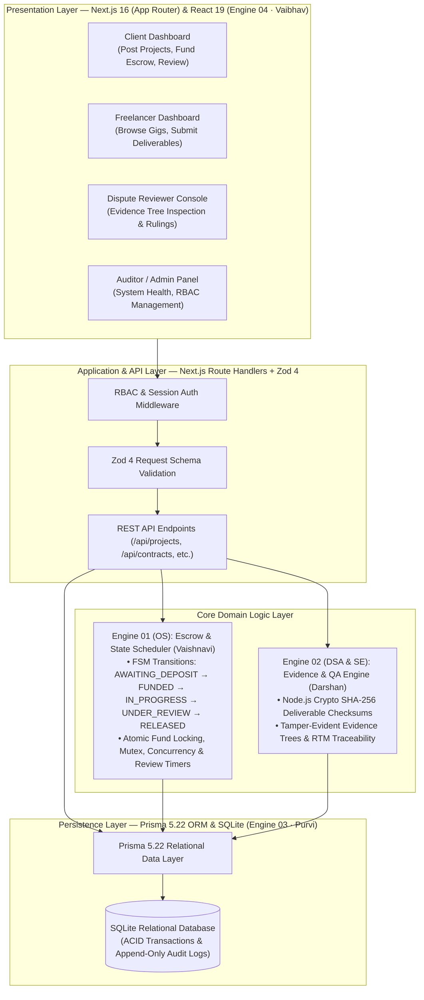

# System Architecture

> **Classification**: Authoritative System Architecture Specification
> **Source Documents**:
> - `docs/source-material/Team07_Escrow_Mini_Project_KLE_Theme.pptx` (Slides 8–17)
> - `docs/source-material/Mini_Project_Gate_0_details_FILLED.docx`
> - `docs/decisions/ADR-001-technology-stack-baseline.md`

---

## 1. Architectural Overview & Four-Engine Topology
The system architecture decomposes the "Milestone-Based Escrow & Evidence-Based Dispute Resolution Workflow" into four distinct, ownable engineering engines aligned with foundational computer science curriculum subjects.

---

## 2. Technology Stack Mapping Matrix

| Layer / Domain | Technology Component | Academic Owner | Status | Authority Reference |
| :--- | :--- | :--- | :--- | :--- |
| **Presentation Layer** | Next.js 16 (App Router), React 19, Tailwind CSS 4, Lucide Icons | Engine 04 · Vaibhav Chavanpatil | Confirmed | Slide 16, ADR-001 |
| **Application / API** | Next.js Server Route Handlers, TypeScript 5, Zod 4 Validation | Engine 04 & Engine 03 | Confirmed | Slide 16 & 17, ADR-001 |
| **Escrow FSM & Scheduling** | Escrow FSM state validator (`escrow-engine.ts`), Atomic fund locking | Engine 01 · Vaishnavi Modekar | Confirmed | Slide 12 & 16, FR-01/02 |
| **Evidence & Cryptography** | Node.js Crypto (`sha256`), Tamper-evident evidence trees | Engine 02 · Darshan Kittur | Confirmed | Slide 13 & 16, FR-03/04 |
| **Persistence Layer** | Prisma 5.22 ORM, SQLite relational database, ACID transactions | Engine 03 · Purvi Sammatshetti | Confirmed | Slide 14 & 16, FR-05/06 |
| **AI Semantic Matching** | Multi-factor skill/budget compatibility (`ai-matcher.ts`) | Engine 02 & Engine 03 | Confirmed | Slide 16 & 17, FR-11 |
| **Audit Logging** | Append-only historical trace (`actor_id`, `action`, `hash`) | Engine 03 · Purvi Sammatshetti | Confirmed | Slide 14, FR-06 |

---

## 3. Inter-Engine Communication Protocol
1. **Transport**: Asynchronous JSON over HTTP via internal Next.js Server Route Handlers.
2. **Data Contracts**: Strongly typed TypeScript interfaces derived directly from Prisma schema models and validated at the boundary using Zod 4 schemas.
3. **Core Contract Action Protocol** (`POST /api/contracts`):
   - `SUBMIT_MILESTONE`: Triggers Engine 02 SHA-256 hash generation, moves status to `SUBMITTED`, contract to `UNDER_REVIEW`.
   - `APPROVE_MILESTONE`: Client verifies deliverable hash proof, marks milestone `APPROVED`.
   - `RELEASE_ESCROW`: Engine 01 validates FSM transition compliance, Engine 03 atomically transfers funds, contract marked `RELEASED`.

---

## 4. Boundary & Modularity Principles
1. **Engine Independence**: Each engine must be testable in isolation using unit tests and mock fixtures before integration.
2. **ACID Transaction Guarantees**: Escrow state transitions and balance debits/credits must execute within single atomic Prisma transactions (`prisma.$transaction`).
3. **Tamper-Evident Verification**: Every deliverable submission must store an immutable SHA-256 checksum in the database. Any discrepancy between stored hash and downloaded deliverable indicates tampering.
