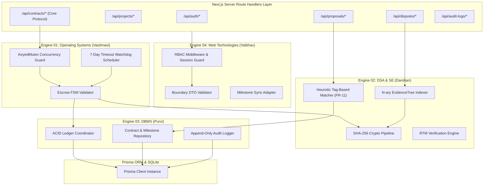

# C4 Architecture Model — Level 3: Components

> **Classification**: Authoritative C4 Component Architecture Specification (Stage S2 — Shared Architecture)
> **Source Documents**:
> - `docs/source-material/Team07_Escrow_Mini_Project_KLE_Theme.pptx` (Slide 16, 17)
> - `docs/architecture/engine-boundaries.md`
> - `docs/architecture/dependency-map.md`

---

## 1. Component Architecture Diagram

The Component diagram reveals the internal structural composition of the Backend API & Application Container, detailing how the four academic engines interface with transport handlers and persistence services.

---

## 2. Component Catalog & Responsibilities

### 2.1 Engine 01 Components (OS Engine · Vaishnavi Modekar)
1. **`EscrowFsmValidator` (`core/engine-01-os/escrow-fsm.ts`)**:
   - Enforces transition legality per the formal state machine specification.
   - Evaluates caller role and pre-conditions before allowing state changes.
2. **`KeyedMutex` (`core/engine-01-os/mutex.ts`)**:
   - In-memory async lock keyed by `milestoneId`.
   - Serializes concurrent release vs dispute calls, preventing TOCTOU race conditions.
3. **`WatchdogScheduler` (`core/engine-01-os/watchdog.ts`)**:
   - Interval-based scheduler evaluating milestones where $T_{\text{submit}} + 7\text{ days} \le \text{Now}()$.
   - Executes automated escalation to prevent freelancer payment starvation.

### 2.2 Engine 02 Components (DSA & SE Engine · Darshan Kittur)
1. **`Sha256Hasher` (`core/engine-02-dsa-se/hasher.ts`)**:
   - Computes deterministic SHA-256 hex strings over binary deliverable buffers.
   - Validates downloaded file bytes against stored checksums.
2. **`EvidenceTreeManager` (`core/engine-02-dsa-se/evidence-tree.ts`)**:
   - Constructs and traverses in-memory N-ary tree of dispute claims and deliverable proofs.
   - Performs $O(V + E)$ Merkle-style bottom-up integrity verification.
3. **`HeuristicSemanticMatcher` (`core/engine-02-dsa-se/matcher.ts`)**:
   - Executes deterministic multi-attribute matching (Jaccard skill overlap, budget fit, DevScore).
   - Generates ranked proposal lists with transparent mathematical weight breakdowns.
4. **`RtmEngine` (`core/engine-02-dsa-se/rtm.ts`)**:
   - Programmatic verification graph mapping requirements to tests and architecture modules.

### 2.3 Engine 03 Components (DBMS Engine · Purvi Sammatshetti)
1. **`LedgerCoordinator` (`core/engine-03-dbms/ledger.ts`)**:
   - Executes atomic financial transfers inside `prisma.$transaction`.
   - Debits/credits simulated user balances while enforcing balance non-negativity ($\ge 0$).
2. **`ContractRepository` (`core/engine-03-dbms/contract-manager.ts`)**:
   - Performs relational CRUD operations for Contracts, Milestones, Projects, and Deliverables.
3. **`AuditLogger` (`core/engine-03-dbms/audit-logger.ts`)**:
   - Appends immutable historical logs with chained cryptographic hashes.
   - Blocks any attempt to update or delete existing audit rows.

### 2.4 Engine 04 Components (Web Technologies Engine · Vaibhav Chavanpatil)
1. **`RbacGuard` (`core/engine-04-web/rbac.ts`)**:
   - Server-side middleware verifying session cookies against required user roles.
   - Rejects unauthorized callers with HTTP 401/403.
2. **`ZodDtoParser` (`lib/validation/index.ts`)**:
   - Validates 100% of incoming request payloads against strict allowlist schemas.
   - Rejects extraneous properties and malicious payloads.
3. **`MilestoneStatePoller` (`core/engine-04-web/poller.ts`)**:
   - Lightweight endpoint returning current milestone statuses for active contracts.
   - Powers the 5-second UI polling loop.
