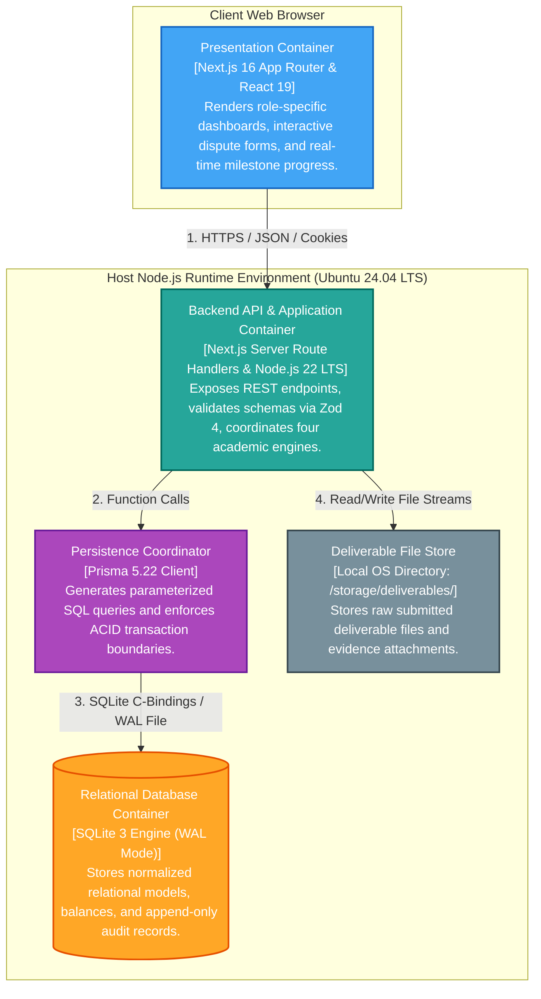

# C4 Architecture Model — Level 2: Containers

> **Classification**: Authoritative C4 Container Architecture Specification (Stage S2 — Shared Architecture)
> **Source Documents**:
> - `docs/source-material/Team07_Escrow_Mini_Project_KLE_Theme.pptx` (Slide 16, 17)
> - `docs/decisions/ADR-001-technology-stack-baseline.md`
> - `docs/architecture/architecture.md`

---

## 1. Container Architecture Diagram

The Container diagram illustrates the high-level technical building blocks that execute within the single deployment unit.

---

## 2. Container Inventory & Specifications

### 2.1 Presentation Container
- **Technology**: Next.js 16 App Router, React 19, Tailwind CSS 4, Lucide Icons.
- **Academic Owner**: Engine 04 (Vaibhav Chavanpatil).
- **Responsibilities**:
  - Delivers server-rendered HTML and client-side hydration for Client, Freelancer, Reviewer, and Admin personas.
  - Implements multi-step forms with client-side Zod validation.
  - Polls backend state every 5 seconds to provide live visual milestone transitions without page refreshes.
- **Protocol**: Consumes REST endpoints over HTTP/1.1 or HTTP/2 using standard `fetch` API.

### 2.2 Backend API & Application Container
- **Technology**: Next.js Server Route Handlers, TypeScript 5, Node.js 22 LTS, Zod 4.
- **Academic Owners**: Shared across all four engines (Vaishnavi, Darshan, Purvi, Vaibhav).
- **Responsibilities**:
  - Serves RESTful endpoints (`/api/contracts`, `/api/projects`, `/api/proposals`, etc.).
  - Enforces server-side RBAC middleware and session token validation.
  - Executes core domain engines (OS FSM, SHA-256 Hasher, EvidenceTree, Heuristic Matcher).
  - Enforces 7-day review watchdog timers.
- **Security**: Strictly sanitizes all input; wraps error responses in standard envelopes without exposing stack traces.

### 2.3 Persistence Coordinator Container
- **Technology**: Prisma ORM 5.22.
- **Academic Owner**: Engine 03 (Purvi Sammatshetti).
- **Responsibilities**:
  - Translates domain operations into parameterized SQLite queries.
  - Manages atomic transactions (`prisma.$transaction`) across user balances, escrow ledgers, and milestone states.
  - Provides type-safe database access for all server route handlers.

### 2.4 Relational Database Container
- **Technology**: SQLite 3.x embedded database file (`prisma/dev.db`).
- **Academic Owner**: Engine 03 (Purvi Sammatshetti).
- **Operational Configuration**:
  - **Journal Mode**: Write-Ahead Logging (`PRAGMA journal_mode = WAL;`) for concurrent read access alongside serialized write locks.
  - **Foreign Keys**: Enforced (`PRAGMA foreign_keys = ON;`).
  - **Synchronous Mode**: Normal (`PRAGMA synchronous = NORMAL;`).
- **Responsibilities**:
  - Guarantees durability and isolation for all financial transactions.
  - Houses the append-only `AUDIT_LOG` table.

### 2.5 Deliverable File Store
- **Technology**: POSIX local filesystem (`/storage/deliverables/`).
- **Academic Owner**: Engine 02 (Darshan Kittur).
- **Responsibilities**:
  - Persists uploaded deliverable ZIPs, documents, and screenshots under cryptographically safe UUID file keys.
  - Provides raw byte streams to Engine 02 for on-demand SHA-256 integrity validation.
