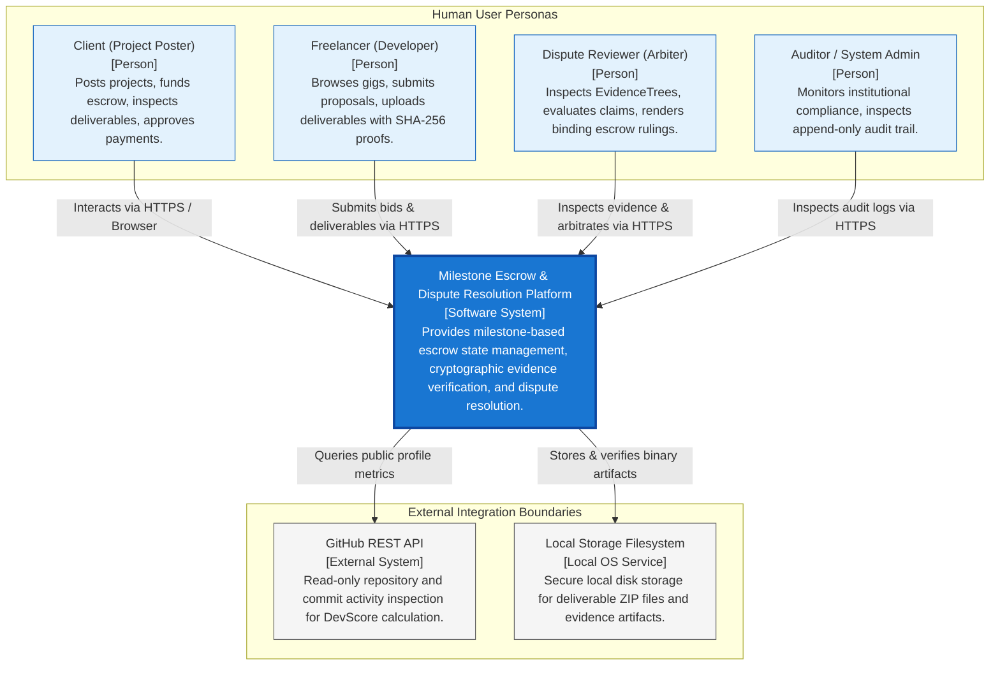

# C4 Architecture Model — Level 1: System Context

> **Classification**: Authoritative C4 Architecture Specification (Stage S2 — Shared Architecture)
> **Source Documents**:
> - `docs/source-material/Team07_Escrow_Mini_Project_KLE_Theme.pptx` (Slide 8, 16, 17)
> - `docs/requirements/team-project-overview.md`
> - `docs/architecture/architecture.md`

---

## 1. System Context Diagram

The System Context diagram illustrates the system boundaries, human actors, and external system integrations.

---

## 2. Actor Responsibilities & Interactions

| Persona / Actor | Role Code | Authentication Method | Primary System Operations |
| :--- | :--- | :--- | :--- |
| **Client** | `CLIENT` | Bcrypt password / Session Token | Creates projects; reviews proposals; executes `DEPOSIT` into escrow; inspects deliverables; triggers `APPROVE` or `RAISE_DISPUTE`. |
| **Freelancer** | `FREELANCER` | Bcrypt password / Session Token | Creates service gigs; submits proposals; triggers `SUBMIT_DELIVERABLE` with SHA-256 hash generation; challenges delayed approvals. |
| **Dispute Reviewer** | `REVIEWER` | Bcrypt password / Session Token | Assigned to open disputes; evaluates N-ary `EvidenceTree`; executes binding arbitration rulings (`RELEASE` or `REFUND`). |
| **Auditor / Admin** | `ADMIN` | Multi-factor / Admin Token | Inspects append-only `AUDIT_LOG` with cryptographic verification hashes; verifies institutional RTM compliance. |

---

## 3. External System Boundaries & Constraints

1. **GitHub REST API (`api.github.com`)**:
   - **Boundary**: Read-only public endpoints (`/users/{username}`, `/users/{username}/repos`).
   - **Purpose**: Retrieves public commit counts and language distributions to calculate developer reputation score (`devScore`).
   - **Failure Mode**: If GitHub is unreachable or rate-limited, system falls back to default neutral score ($50$) without blocking user workflows.
2. **Local Storage Filesystem (`/storage/deliverables/`)**:
   - **Boundary**: Local POSIX filesystem on host server with restricted read/write permissions (`0640`).
   - **Purpose**: Stores binary deliverable uploads (ZIP, PDF, images).
   - **Security**: Uploaded files are addressed by unique UUIDs, avoiding path traversal vulnerabilities.
