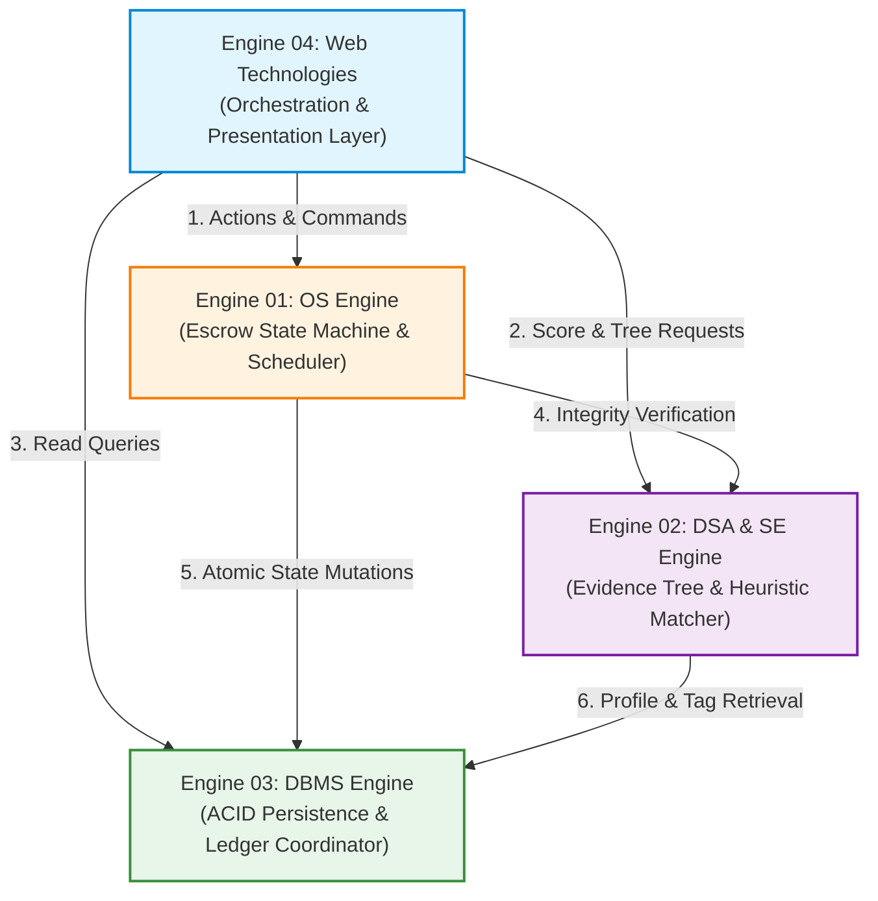
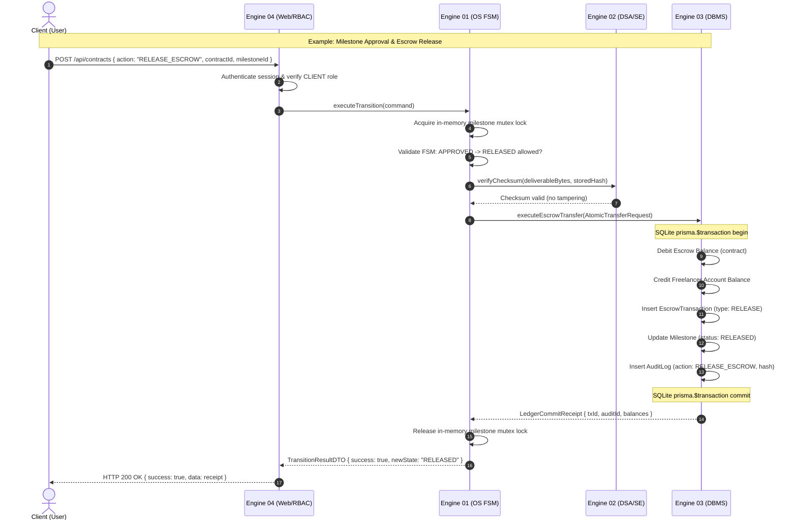

# Inter-Engine Dependency Map & Public Contracts

> **Classification**: Authoritative Inter-Engine Interface & Contract Specification (Stage S2 — Shared Architecture)
> **Source Documents**:
> - `docs/source-material/Team07_Escrow_Mini_Project_KLE_Theme.pptx` (Slides 16–17)
> - `docs/architecture/engine-boundaries.md`
> - `docs/decisions/ADR-003-engine-boundaries.md`

---

## 1. Architectural Dependency Topology & Acyclicity Proof

To maintain clean modular boundaries and prevent spaghetti coupling, inter-engine communication strictly obeys an **Acyclic Directed Graph (DAG)** topology. Circular dependencies between engines are strictly forbidden.



### Topological Ordering Proof
$$\text{Level 0 (Top)}: \text{Engine 04 (Web)}$$
$$\text{Level 1 (Domain)}: \text{Engine 01 (OS)}$$
$$\text{Level 2 (Domain/Algorithms)}: \text{Engine 02 (DSA/SE)}$$
$$\text{Level 3 (Persistence)}: \text{Engine 03 (DBMS)}$$

- All calls flow strictly downward: $E_4 \to \{E_1, E_2, E_3\}$, $E_1 \to \{E_2, E_3\}$, and $E_2 \to E_3$.
- No backward calls exist ($E_3 \not\to E_2$, $E_3 \not\to E_1$, $E_3 \not\to E_4$, $E_2 \not\to E_1$, $E_2 \not\to E_4$, $E_1 \not\to E_4$).
- **Result**: Cycle-free, guaranteeing zero deadlock in module initialization and clean layered testability.

---

## 2. Inter-Engine Public Contracts

### 2.1 Contract: Engine 04 $\to$ Engine 01 (Web Orchestrator to Escrow Scheduler)
- **Purpose**: Dispatches state-modifying actions initiated by users (Deposit, Submit, Approve, Dispute, Release).
- **Protocol**: Strongly typed in-memory asynchronous TypeScript function call.
- **Request DTO (`ExecuteActionCommand`)**:
  ```typescript
  interface ExecuteActionCommand {
    contractId: string;
    milestoneId: string;
    action: 'DEPOSIT' | 'SUBMIT' | 'APPROVE' | 'DISPUTE' | 'RELEASE' | 'REFUND';
    actor: {
      userId: string;
      role: 'CLIENT' | 'FREELANCER' | 'REVIEWER' | 'ADMIN';
    };
    payload?: {
      deliverableUrl?: string;
      submissionNotes?: string;
      disputeReason?: string;
      ruling?: 'RELEASE_TO_FREELANCER' | 'REFUND_TO_CLIENT';
    };
  }
  ```
- **Response DTO (`TransitionResultDTO`)**:
  ```typescript
  interface TransitionResultDTO {
    success: boolean;
    previousState: string;
    newState: string;
    contractId: string;
    milestoneId: string;
    transactionId?: string;
    auditLogId: string;
    timestamp: string;
  }
  ```
- **Idempotency Guarantee**: If an action is re-submitted with the same action and the entity is already in the resulting state, Engine 01 returns the existing state without re-executing balance transfers.
- **Failure Modes**:
  - `InvalidTransitionError` (HTTP 400): Current state cannot transition via requested action.
  - `UnauthorizedActorError` (HTTP 403): Actor role or identity not permitted for this transition.
  - `ConcurrencyLockError` (HTTP 409): Milestone is currently locked by a concurrent in-flight transition.

---

### 2.2 Contract: Engine 01 $\to$ Engine 02 (Escrow Scheduler to Evidence & QA)
- **Purpose**: Verifies that submitted deliverables satisfy cryptographic integrity before milestone state approval.
- **Protocol**: In-memory synchronous / async function call.
- **Request DTO (`VerifyEvidenceRequest`)**:
  ```typescript
  interface VerifyEvidenceRequest {
    milestoneId: string;
    fileBuffer?: Buffer;
    expectedChecksum: string;
  }
  ```
- **Response DTO (`EvidenceVerificationResult`)**:
  ```typescript
  interface EvidenceVerificationResult {
    isValid: boolean;
    computedChecksum: string;
    matched: boolean;
    tamperDetected: boolean;
    verificationTimestamp: string;
  }
  ```
- **Idempotency Guarantee**: Pure mathematical evaluation; $100\%$ idempotent.
- **Failure Modes**:
  - `EvidenceTamperedException`: Computed hash does not match stored hash. Engine 01 aborts transition to `APPROVED`.

---

### 2.3 Contract: Engine 01 $\to$ Engine 03 (Escrow Scheduler to Transaction Ledger)
- **Purpose**: Executes atomic financial transfers and updates contract/milestone state inside SQLite ACID transactions.
- **Protocol**: Asynchronous database transaction coordinator invocation.
- **Request DTO (`AtomicTransferRequest`)**:
  ```typescript
  interface AtomicTransferRequest {
    contractId: string;
    milestoneId: string;
    fromUserId: string;
    toUserId: string;
    amount: number;
    transactionType: 'DEPOSIT' | 'LOCK' | 'RELEASE' | 'REFUND';
    newState: EscrowStatus;
    auditMetadata: {
      actorId: string;
      action: string;
      reason?: string;
    };
  }
  ```
- **Response DTO (`LedgerCommitReceipt`)**:
  ```typescript
  interface LedgerCommitReceipt {
    transactionId: string;
    auditLogId: string;
    fromUserNewBalance: number;
    toUserNewBalance: number;
    contractEscrowBalance: number;
    committedAt: string;
  }
  ```
- **Idempotency Guarantee**: Enforced via unique transaction reference token. Re-executing with identical token returns the cached receipt.
- **Failure Modes**:
  - `InsufficientFundsException`: Payer balance $< \text{amount}$. Entire transaction rolls back.
  - `DatabaseLockException`: SQLite busy/lock contention. Engine 03 retries with exponential backoff up to 3 times before failing closed.

---

### 2.4 Contract: Engine 04 $\to$ Engine 02 (Web Orchestrator to Heuristic Matcher)
- **Purpose**: Requests AI match scoring for proposals and builds the hierarchical EvidenceTree for dispute inspection.
- **Protocol**: In-memory asynchronous function call.
- **Request DTO (`CalculateProposalMatchRequest`)**:
  ```typescript
  interface CalculateProposalMatchRequest {
    projectId: string;
    freelancerId: string;
    bidAmount: number;
  }
  ```
- **Response DTO (`MatchScoreBreakdownDTO`)**:
  ```typescript
  interface MatchScoreBreakdownDTO {
    compositeScore: number; // 0.00 to 100.00
    subScores: {
      skillScore: number;     // Jaccard similarity (0 to 100)
      budgetScore: number;    // Bid-to-budget ratio fit (0 to 100)
      reputationScore: number;// Developer DevScore (0 to 100)
    };
    weights: {
      skillWeight: 0.50;
      budgetWeight: 0.30;
      reputationWeight: 0.20;
    };
    explanation: string;
  }
  ```
- **Idempotency Guarantee**: Deterministic mathematical function; returns identical output for identical inputs.
- **Failure Modes**:
  - `EntityNotFoundError`: Specified project or freelancer does not exist.

---

### 2.5 Contract: Engine 02 $\to$ Engine 03 (Evidence/Matcher to DBMS Persistence)
- **Purpose**: Retrieves project skill tags, developer profiles, and dispute evidence metadata to construct algorithmic models.
- **Protocol**: Strongly typed Prisma query service.
- **Request DTO (`DisputeEvidenceQuery`)**:
  ```typescript
  interface DisputeEvidenceQuery {
    disputeId: string;
  }
  ```
- **Response DTO (`EvidenceRecordDTO[]`)**:
  ```typescript
  interface EvidenceRecordDTO {
    id: string;
    submittedById: string;
    fileUrl: string;
    sha256Checksum: string;
    description: string;
    submittedAt: string;
  }
  ```
- **Idempotency Guarantee**: Read-only queries; strictly idempotent.
- **Failure Modes**:
  - `RecordNotFoundException`: Dispute record does not exist.

---

### 2.6 Contract: Engine 04 $\to$ Engine 03 (Web Dashboards to Read Models)
- **Purpose**: Fetches paginated project listings, user profiles, active contracts, and audit trails for UI presentation.
- **Protocol**: Next.js Server Route Handler data access queries.
- **Request DTO (`DashboardQueryFilter`)**:
  ```typescript
  interface DashboardQueryFilter {
    userId: string;
    role: 'CLIENT' | 'FREELANCER' | 'REVIEWER' | 'ADMIN';
    statusFilter?: string;
    page: number;
    pageSize: number;
  }
  ```
- **Response DTO (`PaginatedResult<T>`)**:
  ```typescript
  interface PaginatedResult<T> {
    items: T[];
    total: number;
    page: number;
    pageSize: number;
    totalPages: number;
  }
  ```
- **Idempotency Guarantee**: Read-only queries; strictly idempotent.
- **Failure Modes**:
  - Returns empty list (`[]`) with `total: 0` if no matching records found.

---

## 3. Cross-Engine Transaction Sequence (Core Contract Action Protocol)


