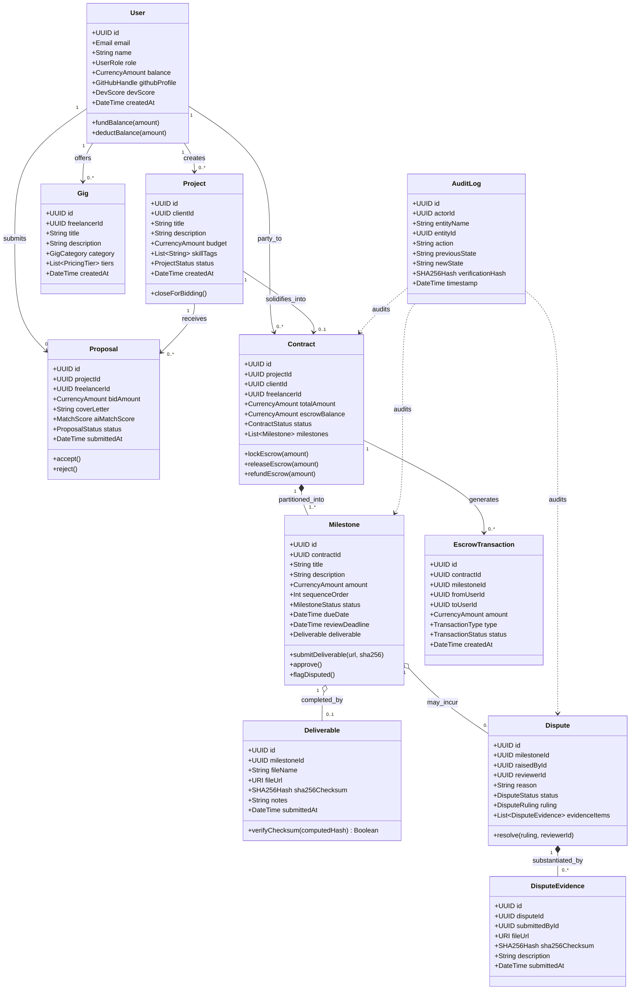

# Domain Model Specification

> **Classification**: Authoritative Domain Model Specification (Stage S2 — Shared Architecture)
> **Source Documents**:
> - `docs/source-material/Team07_Escrow_Mini_Project_KLE_Theme.pptx` (Slides 8, 12, 14, 16, 17)
> - `docs/source-material/Mini_Project_Gate_0_details_FILLED.docx` (Steps 4, 6, 7)
> - `docs/requirements/functional-requirements.md` (FR-01 to FR-12)
> - `docs/requirements/use-cases.md` (UC-01 to UC-05)

---

## 1. Domain Modeling Philosophy & Representation Layers

To prevent coupling and leaking internal persistence concerns across boundaries, the platform explicitly separates four distinct representations of data entities:

1. **Domain Entity (Core Business Model)**: Encapsulates business rules, state transition invariants, and domain logic. Independent of framework or persistence layer.
2. **Database Representation (Prisma / Relational Schema)**: Optimized for BCNF normalization, relational integrity, indexing, foreign keys, and ACID transactions.
3. **API Representation (Data Transfer Objects / DTOs)**: Tailored for secure external exposure over REST endpoints, validated strictly via Zod 4 schemas, scrubbing sensitive fields (e.g. hashed passwords, internal locks).
4. **UI Representation (View Model)**: Formatted for client-side display in Next.js 16 components (formatted currencies, localized timestamps, visual status badges, progress bar percentages).

---

## 2. Core Domain Entity Catalog

---

## 3. Entity Specifications

### 3.1 `User`
- **Purpose**: Represents any authenticated human participant in the platform.
- **Identity**: Unique UUID (`v4`).
- **Attributes**:
  - `id`: UUID (Primary Key)
  - `email`: RFC 5322 Email string (Unique)
  - `passwordHash`: Bcrypt string (Salt rounds: 10; never exposed via API)
  - `name`: Human-readable name
  - `role`: Enum (`CLIENT`, `FREELANCER`, `REVIEWER`, `ADMIN`)
  - `balance`: Non-negative decimal/float (Simulated platform currency)
  - `githubProfile`: Optional GitHub username
  - `devScore`: Cached heuristic developer rating (0–100 integer)
  - `createdAt`: ISO 8601 UTC timestamp
- **Relationships**: Creates Projects/Gigs, submits Proposals, enters Contracts, triggers AuditLogs.
- **Invariants**: Balance $\ge 0.00$. Role cannot be mutated after creation without Admin authority.

### 3.2 `Project`
- **Purpose**: A formal work request posted by a Client seeking bids.
- **Identity**: Unique UUID.
- **Attributes**:
  - `id`: UUID
  - `clientId`: UUID referencing `User.id`
  - `title`: Short project summary
  - `description`: Detailed technical specification
  - `budget`: Positive currency amount
  - `skillTags`: Array of normalized lowercase strings (`["react", "node", "typescript"]`)
  - `status`: Enum (`OPEN`, `IN_PROGRESS`, `COMPLETED`, `CANCELLED`)
  - `createdAt`: ISO 8601 UTC timestamp
- **Relationships**: Belongs to Client; has many Proposals; spawns at most 1 active Contract.
- **Invariants**: Must have at least 1 skill tag. Budget $> 0$. Only `OPEN` projects accept proposals.

### 3.3 `Gig` & `Order`
- **Purpose**: Standardized packaged services offered by Freelancers to Clients.
- **Identity**: Unique UUID.
- **Attributes**:
  - `id`: UUID
  - `freelancerId`: UUID referencing `User.id` (must have role `FREELANCER`)
  - `title`: Service title
  - `description`: Scope of service
  - `category`: Enum (e.g. `WEB_DEV`, `MOBILE_DEV`, `DEVOPS`, `DESIGN`)
  - `tiers`: JSON array containing Basic, Standard, and Premium pricing and turnaround packages
  - `createdAt`: ISO 8601 UTC timestamp
- **Relationships**: Offered by Freelancer; receives Orders from Clients.

### 3.4 `Proposal`
- **Purpose**: A formal bid submitted by a Freelancer to work on a Project.
- **Identity**: Unique UUID.
- **Attributes**:
  - `id`: UUID
  - `projectId`: UUID referencing `Project.id`
  - `freelancerId`: UUID referencing `User.id`
  - `bidAmount`: Positive currency amount
  - `coverLetter`: Text rationale and methodology
  - `aiMatchScore`: Heuristic compatibility score (0.00–100.00 float, generated by Engine 02)
  - `status`: Enum (`PENDING`, `ACCEPTED`, `REJECTED`)
  - `submittedAt`: ISO 8601 UTC timestamp
- **Relationships**: Belongs to Project and Freelancer; acceptance transitions status to `ACCEPTED` and spawns a `Contract`.
- **Invariants**: A freelancer can submit only 1 active proposal per project (`UNIQUE(projectId, freelancerId)`).

### 3.5 `Contract`
- **Purpose**: The legally and financially binding agreement between Client and Freelancer, managing escrow.
- **Identity**: Unique UUID.
- **Attributes**:
  - `id`: UUID
  - `projectId`: UUID referencing `Project.id`
  - `clientId`: UUID referencing `User.id`
  - `freelancerId`: UUID referencing `User.id`
  - `totalAmount`: Sum of all milestone amounts
  - `escrowBalance`: Current funds locked in escrow (initially 0, funded upon deposit)
  - `status`: Enum (`AWAITING_DEPOSIT`, `FUNDED`, `IN_PROGRESS`, `UNDER_REVIEW`, `RELEASED`, `REFUNDED`, `DISPUTED`)
  - `createdAt`: ISO 8601 UTC timestamp
  - `updatedAt`: ISO 8601 UTC timestamp
- **Relationships**: Generated from accepted Proposal; contains 1 or more Milestones; accumulates EscrowTransactions.
- **Invariants**: $0 \le \text{escrowBalance} \le \text{totalAmount}$. Client and Freelancer cannot be the same User (`clientId != freelancerId`).

### 3.6 `Milestone`
- **Purpose**: Discrete deliverable phase within a Contract governing escrow release.
- **Identity**: Unique UUID.
- **Attributes**:
  - `id`: UUID
  - `contractId`: UUID referencing `Contract.id`
  - `title`: Milestone name
  - `description`: Expected deliverables
  - `amount`: Positive currency portion of total contract
  - `sequenceOrder`: 1-based integer ordering
  - `status`: Enum (`PENDING`, `FUNDED`, `IN_PROGRESS`, `SUBMITTED`, `APPROVED`, `RELEASED`, `DISPUTED`)
  - `dueDate`: ISO 8601 UTC timestamp
  - `reviewDeadline`: Optional timestamp ($T_{\text{submit}} + 7\text{ days}$) for watchdog monitoring
- **Relationships**: Child of Contract; has at most 1 Deliverable; may trigger 1 Dispute.
- **Invariants**: $\sum \text{Milestone.amount} = \text{Contract.totalAmount}$. Sequence order must be monotonic without gaps.

### 3.7 `Deliverable`
- **Purpose**: Concrete digital evidence submitted by a Freelancer to prove milestone completion.
- **Identity**: Unique UUID.
- **Attributes**:
  - `id`: UUID
  - `milestoneId`: UUID referencing `Milestone.id` (Unique 1-to-1)
  - `fileName`: Original upload filename
  - `fileUrl`: Local storage URI path
  - `sha256Checksum`: Exactly 64-character hexadecimal SHA-256 string
  - `submissionNotes`: Description provided by developer
  - `submittedAt`: ISO 8601 UTC timestamp
- **Relationships**: Owned by Milestone; indexed into Engine 02 `EvidenceTree`.
- **Invariants**: `sha256Checksum` is immutable once recorded; regex match `/^[a-f0-9]{64}$/`.

### 3.8 `Dispute` & `DisputeEvidence`
- **Purpose**: Formal arbitration claim raised when Client rejects deliverable or Freelancer challenges non-responsiveness.
- **Identity**: Unique UUID.
- **Attributes**:
  - `id`: UUID
  - `milestoneId`: UUID referencing `Milestone.id`
  - `raisedById`: UUID referencing `User.id`
  - `reviewerId`: Optional UUID referencing `User.id` (role `REVIEWER`)
  - `reason`: Claim narrative
  - `status`: Enum (`OPEN`, `UNDER_REVIEW`, `RESOLVED`, `REJECTED`)
  - `ruling`: Optional Enum (`RELEASE_TO_FREELANCER`, `REFUND_TO_CLIENT`, `SPLIT_SETTLEMENT`)
  - `resolutionRulingNotes`: Arbiter narrative justification
  - `createdAt`: ISO 8601 UTC timestamp
  - `resolvedAt`: Optional timestamp
- **Relationships**: Belongs to Milestone; has many DisputeEvidence items; arbitrated by Reviewer.
- **Invariants**: Can only be raised on milestones in `SUBMITTED`, `UNDER_REVIEW`, or `APPROVED` (prior to release).

### 3.9 `EscrowTransaction` (Ledger Entry)
- **Purpose**: Append-only double-entry financial record tracking every simulated money movement.
- **Identity**: Unique UUID.
- **Attributes**:
  - `id`: UUID
  - `contractId`: UUID referencing `Contract.id`
  - `milestoneId`: Optional UUID referencing `Milestone.id`
  - `fromUserId`: UUID referencing debit account (or system escrow account)
  - `toUserId`: UUID referencing credit account (or system escrow account)
  - `amount`: Positive currency value
  - `type`: Enum (`DEPOSIT`, `LOCK`, `RELEASE`, `REFUND`)
  - `status`: Enum (`PENDING`, `COMPLETED`, `FAILED`)
  - `createdAt`: ISO 8601 UTC timestamp
- **Invariants**: Once written with `COMPLETED`, records are immutable. `amount > 0`.

### 3.10 `AuditLog`
- **Purpose**: Tamper-resistant historical traceability record for institutional compliance.
- **Identity**: Unique UUID.
- **Attributes**:
  - `id`: UUID
  - `actorId`: UUID of user or `SYSTEM`
  - `entityName`: Table name (e.g. `Contract`, `Milestone`, `Dispute`)
  - `entityId`: UUID of affected record
  - `action`: State-modifying verb (e.g. `LOCK_ESCROW`, `SUBMIT_DELIVERABLE`, `RELEASE_ESCROW`)
  - `previousState`: Serialized JSON or state string
  - `newState`: Serialized JSON or state string
  - `verificationHash`: SHA-256 of `(actorId + entityId + action + newState + timestamp)`
  - `timestamp`: ISO 8601 UTC timestamp
- **Invariants**: Append-only; zero `UPDATE` or `DELETE` SQL operations permitted.

---

## 4. Layer Separation Mapping (Domain vs DB vs API vs UI)

| Field / Entity Concept | Domain Model | Database Representation | API DTO (REST) | UI View Model |
| :--- | :--- | :--- | :--- | :--- |
| **Password** | Not in entity domain logic | `password_hash: TEXT` | Never exposed (`Omit<User, 'password'>`) | N/A |
| **Money / Balance** | `CurrencyAmount` (value object) | `balance: REAL` (SQLite IEEE 754 float/integer cents) | `balance: number` | Formatted: `"$1,250.00"` |
| **Escrow Status** | FSM State Enum | `VARCHAR(32)` | String Enum | Visual Badge: `<Badge color="amber">Funded</Badge>` |
| **Deliverable Hash** | `SHA256Hash` (validated hex) | `sha256_checksum: VARCHAR(64)` | `checksum: string` | Truncated with copy button: `a1b2c3...f4e5` |
| **AI Match Score** | `MatchScore` (0.0–100.0) | `ai_match_score: REAL` | `matchScore: number` | Circular Progress Meter: `"88% Match"` |
