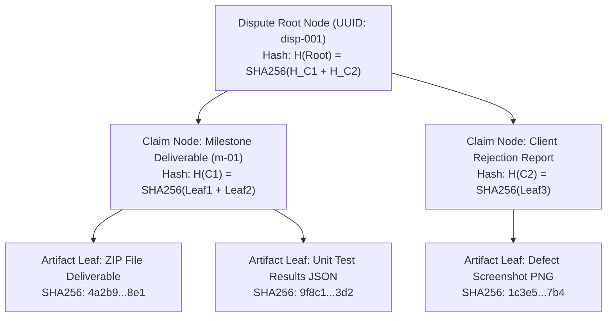

# Data Structures, Algorithms & Software Engineering (Engine 02) Architecture

> **Classification**: Authoritative DSA & Algorithms Architecture Specification (Stage S2 — Shared Architecture)
> **Engine Owner**: Darshan Kittur (Roll No: 18, SRN: `02FE24BCS053`)
> **Source Documents**:
> - `docs/source-material/Team07_Escrow_Mini_Project_KLE_Theme.pptx` (Slide 11, 13, 16, 17)
> - `docs/requirements/functional-requirements.md` (FR-03, FR-04, FR-11)
> - `docs/requirements/gate-1-team-decisions.md` (Decision D-01)
> - `docs/decisions/ADR-009-evidence-integrity.md`
> - `docs/decisions/ADR-010-ai-matching.md`

---

## 1. Algorithmic Overview & Scope

Engine 02 is responsible for the system's core mathematical and algorithmic machinery:
1. **Cryptographic Checksum Pipeline**: Streaming SHA-256 deliverable digest verification.
2. **N-ary EvidenceTree Hierarchical Index**: An in-memory tree structure organizing dispute claims, milestone deliverables, test logs, and reviewer annotations with $O(V + E)$ verification traversal.
3. **Deterministic Heuristic Tag-Based Semantic Proposal Matcher (FR-11)**: Multi-attribute composite scoring algorithm utilizing Jaccard set similarity, budget-fit normalization, and developer reputation weighting.
4. **Requirements Traceability Matrix (RTM) Engine**: Automated bidirectional validation graph verifying $100\%$ requirements coverage.

---

## 2. Cryptographic SHA-256 Evidence Pipeline

### 2.1 Algorithm Specification
- **Algorithm**: Secure Hash Algorithm 2 (SHA-256, FIPS PUB 180-4).
- **Module**: Native Node.js `node:crypto`.
- **Mathematical Form**:
  $$H = \text{SHA-256}(B) \in \{0, 1\}^{256} \xrightarrow{\text{hex}} [0-9a-f]^{64}$$
  Where $B$ is the sequence of raw binary bytes comprising the deliverable file.
- **Properties Enforced**:
  - **Pre-image Resistance**: Computationally infeasible to synthesize file $B'$ such that $\text{SHA-256}(B') = H$.
  - **Collision Resistance**: Computationally infeasible to find $B_1 \neq B_2$ such that $\text{SHA-256}(B_1) = \text{SHA-256}(B_2)$.
  - **Deterministic Output**: Given identical byte stream $B$, output string is identically identical.
- **Complexity**: $O(N)$ where $N$ is file size in bytes; streaming chunks processed in 64 KB memory blocks.

---

## 3. The N-ary `EvidenceTree` Data Structure

### 3.1 Structural Definition
Dispute resolution requires arbiters to inspect a structured hierarchy of claims, contract terms, deliverables, test execution logs, and communication artifacts. The `EvidenceTree` is an in-memory N-ary tree with bottom-up Merkle-style cryptographic integrity hashing.



### 3.2 Node Schema (`EvidenceNode`)
```typescript
export enum EvidenceNodeType {
  ROOT = 'ROOT',
  CLAIM = 'CLAIM',
  DELIVERABLE = 'DELIVERABLE',
  TEST_LOG = 'TEST_LOG',
  COMMUNICATION = 'COMMUNICATION',
}

export interface EvidenceNode {
  id: string;                      // Unique UUID
  parentId: string | null;         // Pointer to parent node
  type: EvidenceNodeType;
  title: string;
  metadata: Record<string, string>;
  payloadChecksum: string;         // SHA-256 of attached binary artifact or text
  merkleHash: string;              // Bottom-up combined integrity hash
  children: EvidenceNode[];        // Ordered list of child nodes
  timestamp: string;
}
```

### 3.3 Traversal & Verification Algorithms
1. **Tree Construction**: $O(V)$ time, building node objects and linking child arrays from flat database records.
2. **Bottom-Up Merkle Hash Computation (Post-Order DFS)**:
   $$\text{merkleHash}(u) = \begin{cases}
   \text{payloadChecksum}(u) & \text{if } u \text{ is leaf} \\
   \text{SHA256}\left(\text{payloadChecksum}(u) \parallel \sum_{v \in \text{children}(u)} \text{merkleHash}(v)\right) & \text{if } u \text{ is internal}
   \end{cases}$$
3. **Tamper Detection (Breadth-First Search)**:
   - Traverses all $V$ nodes and $E$ edges in $O(V + E)$ time.
   - Computes expected Merkle hash at each node. If any leaf payload checksum fails to match the downloaded file bytes, the discrepancy bubbles up to the root, immediately highlighting the tampered branch.

---

## 4. Heuristic Tag-Based Proposal Matcher Algorithm (FR-11)

### 4.1 Academic Clarification: Heuristic vs Stochastic AI
The system requirement specifies a **deterministic multi-attribute heuristic matcher** based on set similarity and mathematical scoring, rather than a black-box large language model. This guarantees:
1. $100\%$ explainable and auditable scores for both Clients and Freelancers.
2. Absolute reproducibility across evaluation Viva sessions.
3. Zero API latency and zero cost overhead.

### 4.2 Mathematical Scoring Formulation

The composite match score $S_{\text{match}}(P, D) \in [0.00, 100.00]$ is computed as a weighted sum of three normalized sub-scores:

$$S_{\text{match}}(P, D) = (w_{\text{skill}} \cdot S_{\text{skill}}) + (w_{\text{budget}} \cdot S_{\text{budget}}) + (w_{\text{rep}} \cdot S_{\text{rep}})$$

Where weights satisfy the normalization constraint:
$$w_{\text{skill}} + w_{\text{budget}} + w_{\text{rep}} = 0.50 + 0.30 + 0.20 = 1.00$$

#### Component 1: Skill Compatibility ($S_{\text{skill}}$, Weight $w = 0.50$)
Computed via the **Jaccard Similarity Coefficient** over normalized lowercase token sets:
$$T_P = \text{SkillTags}(P), \quad T_D = \text{Skills}(D)$$
$$J(T_P, T_D) = \frac{|T_P \cap T_D|}{|T_P \cup T_D|}$$
$$S_{\text{skill}} = J(T_P, T_D) \times 100$$
- If project requires `['react', 'node', 'typescript']` and developer profile has `['react', 'node', 'python']`:
  - Intersection = `{'react', 'node'}` (size 2)
  - Union = `{'react', 'node', 'typescript', 'python'}` (size 4)
  - $J = 2 / 4 = 0.50 \implies S_{\text{skill}} = 50.00$

#### Component 2: Budget Compatibility ($S_{\text{budget}}$, Weight $w = 0.30$)
Evaluates how closely the freelancer's bid $B_{\text{bid}}$ aligns with the client's posted budget $B_{\text{target}}$:
$$\text{Ratio} = \frac{B_{\text{bid}}}{B_{\text{target}}}$$
$$S_{\text{budget}} = \begin{cases}
100.00 & \text{if } \text{Ratio} = 1.00 \\
\max(0.00, 100.00 - (|\text{Ratio} - 1.00| \times 100)) & \text{if } 0.50 \le \text{Ratio} \le 1.50 \\
0.00 & \text{otherwise}
\end{cases}$$
- A bid matching target budget yields $100$. A bid $20\%$ above or below yields $80$. Bids deviating $> 50\%$ yield $0$.

#### Component 3: Developer Reputation & DevScore ($S_{\text{rep}}$, Weight $w = 0.20$)
Utilizes the developer's verified platform rating (derived from completed contracts and verified GitHub profile metrics):
$$S_{\text{rep}} = \text{clamp}(\text{DevScore}(D), 0, 100)$$

### 4.3 Composite Score Worked Example
- Client Project: Budget = $\$1,000$, Skills = `['react', 'node', 'typescript']`
- Developer Proposal: Bid = $\$900$, Skills = `['react', 'node']`, DevScore = $85$
1. $S_{\text{skill}} = (2 / 4) \times 100 = 50.00$
2. $\text{Ratio} = 900 / 1000 = 0.90 \implies S_{\text{budget}} = 100 - (|0.90 - 1.00| \times 100) = 90.00$
3. $S_{\text{rep}} = 85.00$
4. Composite:
   $$S_{\text{match}} = (0.50 \times 50.00) + (0.30 \times 90.00) + (0.20 \times 85.00) = 25.00 + 27.00 + 17.00 = 69.00\%$$

### 4.4 Computational Complexity & Ranking
- For $M$ proposals on a project with $N$ skill tags, computing all match scores has time complexity:
  $$O(M \cdot (|T_P| + |T_D|))$$
- Sorting ranked proposals uses standard dual-pivot Quicksort ($O(M \log M)$).
- **Tie-Breaking Rule**: In case of identical composite scores, higher `devScore` breaks ties; if still tied, earlier `submittedAt` timestamp takes precedence.
