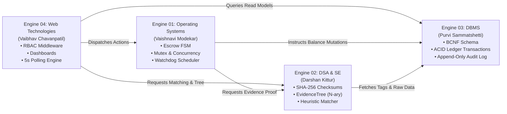

# Academic Engine Boundaries Specification

> **Classification**: Authoritative Engine Decomposition & Ownership Specification (Stage S2 — Shared Architecture)
> **Source Documents**:
> - `docs/source-material/Team07_Escrow_Mini_Project_KLE_Theme.pptx` (Slides 10–15)
> - `docs/source-material/Mini_Project_Gate_0_details_FILLED.docx` (Steps 4, 6, 7)
> - `AGENTS.md` (Section 3)
> - `docs/requirements/team-project-overview.md`
> - `docs/requirements/functional-requirements.md`

---

## 1. Engine Decomposition Overview

The platform partitions all system responsibilities into four independently ownable, testable, and demonstrable engineering engines aligned with the KLE Technological University Computer Science curriculum.



---

## 2. Engine 01 (OS Engine) — Escrow & State Scheduler

### 2.1 Academic Identity & Ownership
- **Engine Owner**: Vaishnavi Modekar (Roll No: 21, SRN: `02FE24BCS060`)
- **Academic Subject Domain**: Operating Systems (Concurrency, Scheduling, State Synchronization, Mutual Exclusion)
- **Primary Requirements Owned**: FR-01 (Escrow FSM), FR-02 (Timeout Watchdog), FR-12 (Atomic Multi-State Transitions)
- **Supporting NFRs**: NFR-05 (Fault Tolerance), NFR-08 (Concurrency Safety)

### 2.2 Mission & Responsibilities
- Serve as the authoritative single source of truth for the Escrow Lifecycle Finite State Machine.
- Schedule and validate state transitions (`AWAITING_DEPOSIT` $\to$ `FUNDED` $\to$ `IN_PROGRESS` $\to$ `SUBMITTED` $\to$ `UNDER_REVIEW` $\to$ `APPROVED` $\to$ `RELEASED` / `DISPUTED`).
- Prevent race conditions and double-spending across concurrent client actions using memory mutexes and serialized critical sections.
- Enforce the 7-day client review timeout watchdog, preventing freelancer payment starvation.

### 2.3 Boundaries & Interfaces
- **Inputs**:
  - Transition requests (`contractId`, `milestoneId`, `action`, `actorId`, `actorRole`).
  - System timer clock ticks for timeout watchdog monitoring.
- **Outputs**:
  - Transition validation verdicts (`ALLOWED` or `REJECTED` with specific error code).
  - State change dispatch commands to Engine 03 for atomic ledger mutation.
- **Public Interface (`IEscrowEngine`)**:
  ```typescript
  interface IEscrowEngine {
    validateTransition(current: EscrowStatus, target: EscrowStatus): TransitionResult;
    executeTransition(request: TransitionRequest): Promise<TransitionOutcome>;
    checkReviewTimeouts(): Promise<TimeoutSummary>;
    acquireMilestoneLock(milestoneId: string): Promise<LockToken>;
    releaseMilestoneLock(token: LockToken): Promise<void>;
  }
  ```
- **Data Access Boundary**:
  - Engine 01 **does not** execute raw SQL queries.
  - It delegates all persistence updates to Engine 03 via strongly typed service calls.
- **Invariants Enforced**: INV-01 (No double-funding), INV-02 (Strict single-release), INV-04 (Sequential milestone lifecycle), INV-09 (Review timeout watchdog).
- **Academic Evidence**: State transition matrices, critical-section lock benchmarks, timer interrupt emulation tests, mutual exclusion proofs.

---

## 3. Engine 02 (DSA & SE Engine) — Evidence & Quality Assurance Engine

### 3.1 Academic Identity & Ownership
- **Engine Owner**: Darshan Kittur (Roll No: 18, SRN: `02FE24BCS053`)
- **Academic Subject Domain**: Data Structures, Algorithms & Software Engineering (Trees, Cryptographic Hashing, Verification & Validation)
- **Primary Requirements Owned**: FR-03 (SHA-256 Deliverable Checksums), FR-04 (Evidence Tree Indexing), FR-11 (Heuristic Semantic Matching — PRIMARY OWNER)
- **Supporting NFRs**: NFR-03 (Data Integrity), NFR-07 (Requirements Traceability)

### 3.2 Mission & Responsibilities
- Calculate and verify cryptographic SHA-256 digests over all submitted deliverable files and URLs.
- Construct, manage, and traverse an in-memory N-ary `EvidenceTree` that structures all dispute evidence into verifiable hierarchical nodes with $O(V+E)$ complexity.
- Execute the deterministic heuristic tag-based proposal matching algorithm (FR-11), calculating multi-attribute match scores ($0–100\%$) based on skill overlap, budget compatibility, and developer rating.
- Maintain the Requirements Traceability Matrix (RTM) and verification test suites.

### 3.3 Boundaries & Interfaces
- **Inputs**:
  - Deliverable file binary streams / buffers for SHA-256 checksum generation.
  - Raw evidence metadata arrays for `EvidenceTree` construction.
  - Project skill tags and developer proposal attributes for heuristic matching.
- **Outputs**:
  - 64-character hexadecimal SHA-256 checksum strings.
  - Hierarchical `EvidenceTree` structure with integrity validation proofs.
  - Match scores ($0.00–100.00$) with transparent explainability weight breakdowns.
- **Public Interface (`IEvidenceAndMatcherEngine`)**:
  ```typescript
  interface IEvidenceAndMatcherEngine {
    generateChecksum(buffer: Buffer): string;
    verifyChecksum(buffer: Buffer, expectedHash: string): boolean;
    buildEvidenceTree(disputeId: string, items: EvidenceItemDTO[]): EvidenceTree;
    calculateMatchScore(project: ProjectMatchDTO, proposal: ProposalMatchDTO): MatchResult;
    verifyRTMIntegrity(): RTMValidationReport;
  }
  ```
- **Data Access Boundary**:
  - Reads project tags and developer profiles via Engine 03 queries.
  - Pure algorithmic engine: does not write directly to the database. Checksums and tree states are persisted via Engine 03.
- **Invariants Enforced**: INV-06 (Cryptographic evidence immutability), INV-08 (Deterministic match score reproducibility).
- **Academic Evidence**: Tree traversal benchmarks ($O(V+E)$ DFS/BFS), SHA-256 collision resistance verification, Jaccard similarity mathematical proofs, RTM verification coverage.

---

## 4. Engine 03 (DBMS Engine) — Transaction Ledger & Contract Manager

### 4.1 Academic Identity & Ownership
- **Engine Owner**: Purvi Sammatshetti (Roll No: 11, SRN: `02FE24BCS022`)
- **Academic Subject Domain**: Database Management Systems (Relational Modeling, BCNF Normalization, ACID Transactions, Append-Only Storage)
- **Primary Requirements Owned**: FR-05 (ACID Escrow Balance Transfers), FR-06 (Append-Only Audit Logging), FR-11 (Supporting persistence dependency)
- **Supporting NFRs**: NFR-08 (ACID Transaction Integrity), NFR-09 (Tamper-Resistant Audit Trail)

### 4.2 Mission & Responsibilities
- Architect and maintain the relational schema in Boyce-Codd Normal Form (BCNF) with foreign key cascades and unique constraints.
- Manage all persistence operations using Prisma 5.22 ORM over SQLite in Write-Ahead Logging (WAL) mode.
- Execute atomic financial balance transfers (`prisma.$transaction`) ensuring conservation of money ($\sum \Delta\text{balance} = 0$).
- Record append-only, tamper-resistant audit logs with cryptographic hash chaining for institutional transparency.
- Provide indexed data queries supporting Engine 02's matching heuristic.

### 4.3 Boundaries & Interfaces
- **Inputs**:
  - Transaction requests from Engine 01 (deposit, fund lock, release, refund).
  - Audit log event payloads from all engines.
  - Query parameters from Engine 04 (dashboards, listings).
- **Outputs**:
  - Committed ledger transaction records.
  - Strongly typed relational entity DTOs.
  - Append-only audit history trails.
- **Public Interface (`IDbmsLedgerEngine`)**:
  ```typescript
  interface IDbmsLedgerEngine {
    executeEscrowTransfer(tx: EscrowTransferRequest): Promise<LedgerResult>;
    appendAuditLog(entry: AuditEntryDTO): Promise<AuditLogRecord>;
    getContractWithMilestones(contractId: string): Promise<ContractAggregate | null>;
    getProjectProposals(projectId: string): Promise<ProposalEntity[]>;
    recordDeliverableSubmission(submission: DeliverableSubmissionDTO): Promise<DeliverableRecord>;
  }
  ```
- **Data Access Boundary**:
  - Sole engine with direct access to Prisma Client and SQLite database.
  - All database mutations must pass through Engine 03's transaction coordinator.
- **Invariants Enforced**: INV-01 (No double-funding), INV-03 (Conservation of financial balances), INV-07 (Append-only audit trail immutability).
- **Academic Evidence**: BCNF normalization proofs (1NF $\to$ 2NF $\to$ 3NF $\to$ BCNF), ACID rollback test runs under simulated crash, SQLite WAL concurrent read/write throughput metrics.

---

## 5. Engine 04 (Web Technologies Engine) — Role-Based Workflow Dashboard

### 5.1 Academic Identity & Ownership
- **Engine Owner**: Vaibhav Chavanpatil (Roll No: 4, SRN: `02FE24BCS013`)
- **Academic Subject Domain**: Web Technologies & Human-Computer Interaction (Next.js App Router, React 19, RBAC Middleware, Client State Synchronization)
- **Primary Requirements Owned**: FR-07 (Dispute Submission Forms), FR-08 (Server-Side RBAC Enforcement), FR-09 (Developer Marketplace & Gigs), FR-10 (Real-Time 5s Polling State UI)
- **Supporting NFRs**: NFR-02 (Access Control Enforcement), NFR-04 (Input Sanitization & Validation)

### 5.2 Mission & Responsibilities
- Implement responsive, accessible, role-tailored presentation dashboards for all four platform personas: Client, Freelancer, Dispute Reviewer, and Auditor/Admin.
- Enforce strict server-side Role-Based Access Control (RBAC) via Next.js middleware and API route guards, returning HTTP 401/403 for unauthorized requests.
- Provide intuitive multi-step form workflows with real-time client-side Zod validation for project creation, proposal bidding, and dispute filing.
- Implement the 5-second polling state synchronization engine ensuring client dashboards reflect live escrow transitions without page reloads.

### 5.3 Boundaries & Interfaces
- **Inputs**:
  - User HTTP requests (browser interactions, form submissions, session tokens).
  - Server-sent polling requests for milestone state updates.
- **Outputs**:
  - Accessible, responsive HTML/React component trees styled with Tailwind CSS 4.
  - Sanitized JSON API payloads dispatched to Route Handlers.
  - Visual status indicators, progress meters, and dispute evidence inspectors.
- **Public Interface (`IWebEngine`)**:
  ```typescript
  interface IWebEngine {
    authenticateSession(req: NextRequest): Promise<SessionContext>;
    enforceRbac(session: SessionContext, requiredRole: UserRole): void;
    validatePayload<T>(schema: ZodSchema<T>, data: unknown): T;
    renderDashboard(role: UserRole, session: SessionContext): ReactNode;
    pollMilestoneState(contractId: string): Promise<MilestoneStateView>;
  }
  ```
- **Data Access Boundary**:
  - Interacts exclusively with Next.js Server Route Handlers over HTTP / internal server actions.
  - **Never** invokes direct database queries or raw SQL from React UI components.
- **Invariants Enforced**: INV-05 (Server-side RBAC authorization), Client-side input validation boundaries.
- **Academic Evidence**: RBAC penetration/tampering test logs (asserting 403 Forbidden on role-spoofing), Lighthouse accessibility/performance scores ($\ge 90$), responsive mobile/desktop viewport validation proofs.

---

## 6. Engine Responsibility & Verification Matrix

| Responsibility Domain | E1 (OS) Vaishnavi | E2 (DSA/SE) Darshan | E3 (DBMS) Purvi | E4 (Web) Vaibhav |
| :--- | :---: | :---: | :---: | :---: |
| **Escrow State Machine Validation** | **PRIMARY** | — | — | Consumes |
| **Watchdog Timer Scheduler** | **PRIMARY** | — | — | Visualizes |
| **Cryptographic SHA-256 Hashing** | — | **PRIMARY** | Persists | Consumes |
| **N-ary EvidenceTree Construction** | — | **PRIMARY** | Stores nodes | Renders tree |
| **Heuristic Proposal Matching (FR-11)** | — | **PRIMARY (Math)** | Supporting (Data) | Renders score |
| **ACID Financial Ledger Transactions** | Triggers | — | **PRIMARY** | Consumes |
| **Append-Only Audit Trail Logging** | Emits | Emits | **PRIMARY** | Displays (Admin) |
| **Role-Based Access Control (RBAC)** | Validates actor | — | Schema roles | **PRIMARY (Enforcer)** |
| **5-Second Polling Synchronization** | Provides status | — | Serves read queries | **PRIMARY** |
| **Multi-Role Responsive UI & Forms** | — | — | — | **PRIMARY** |
