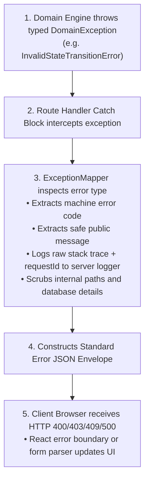

# Error Architecture & Exception Taxonomy

> **Classification**: Authoritative Error Architecture Specification (Stage S2 — Shared Architecture)
> **Source Documents**:
> - `docs/requirements/functional-requirements.md`
> - `docs/architecture/architecture.md`
> - `docs/api/api-design.md`

---

## 1. Architectural Error Philosophy

1. **Fail-Closed & Secure**: Any failure in authorization, state verification, or transactional integrity immediately aborts the operation without mutating state.
2. **Layered Decoupling**: Core engines throw domain-specific typed exceptions. The application transport layer catches domain exceptions and maps them to standard HTTP status codes and JSON envelopes.
3. **Zero Information Leakage**: Database connection strings, SQL query text, file system paths, and internal stack traces are strictly stripped before sending responses to external callers.
4. **Actionable Client Feedback**: Error responses provide machine-readable error codes and specific field validation paths so UI components can annotate form inputs directly.

---

## 2. Standard Error Taxonomy & Layer Mapping

| Domain Exception Class | Application Error Code | HTTP Status | Standard Client Message | UI Handling Strategy |
| :--- | :--- | :---: | :--- | :--- |
| `ZodValidationError` | `VALIDATION_FAILED` | `400` | "The submitted form data failed schema validation." | Annotates individual invalid form inputs with field error text. |
| `AuthenticationRequiredError` | `UNAUTHENTICATED` | `401` | "Authentication is required to access this resource." | Redirects user to `/login` with `returnUrl` query parameter. |
| `UnauthorizedRoleError` | `FORBIDDEN` | `403` | "Your current role is not authorized to execute this action." | Displays access-denied banner; hides forbidden action buttons. |
| `EntityNotFoundError` | `RESOURCE_NOT_FOUND` | `404` | "The requested project, contract, or milestone was not found." | Renders 404 Empty State view with link to dashboard. |
| `InvalidStateTransitionError` | `INVALID_STATE_TRANSITION` | `400` | "This action is not permitted in the current milestone state." | Triggers toast alert; re-polls contract state to update UI buttons. |
| `ConcurrencyMutexConflict` | `STATE_MUTEX_LOCKED` | `409` | "A concurrent operation is in progress on this milestone." | Prompts user to retry after 2 seconds; disables submit button. |
| `DoubleAllocationError` | `ESCROW_ALREADY_ALLOCATED` | `409` | "Escrow funds for this contract have already been funded." | Disables deposit button; transitions UI to Funded state. |
| `InsufficientFundsError` | `INSUFFICIENT_FUNDS` | `422` | "Your account balance is insufficient to complete this transfer." | Displays funding modal prompting client to top up balance. |
| `EvidenceTamperedException` | `EVIDENCE_TAMPERING_DETECTED`| `422` | "Deliverable checksum mismatch detected; file integrity compromised." | Highlights deliverable with red warning; flags dispute arbiter. |
| `TransactionAbortedError` | `TRANSACTION_ROLLBACK` | `500` | "Financial transaction could not be completed; all changes reverted." | Displays critical error banner; advises user to contact support. |
| `InternalServerError` | `INTERNAL_SERVER_ERROR` | `500` | "An unexpected internal error occurred." | Generic error toast with `requestId` for institutional audit tracing. |

---

## 3. End-to-End Error Flow & Sanitization



### TypeScript Exception Definition Pattern
```typescript
export abstract class DomainError extends Error {
  abstract readonly code: string;
  abstract readonly statusCode: number;

  constructor(message: string, public readonly details: Record<string, unknown> = {}) {
    super(message);
    Object.setPrototypeOf(this, new.target.prototype);
  }
}

export class InvalidStateTransitionError extends DomainError {
  readonly code = 'INVALID_STATE_TRANSITION';
  readonly statusCode = 400;

  constructor(public readonly fromState: string, public readonly action: string) {
    super(`Action '${action}' is illegal from current state '${fromState}'.`);
  }
}
```
