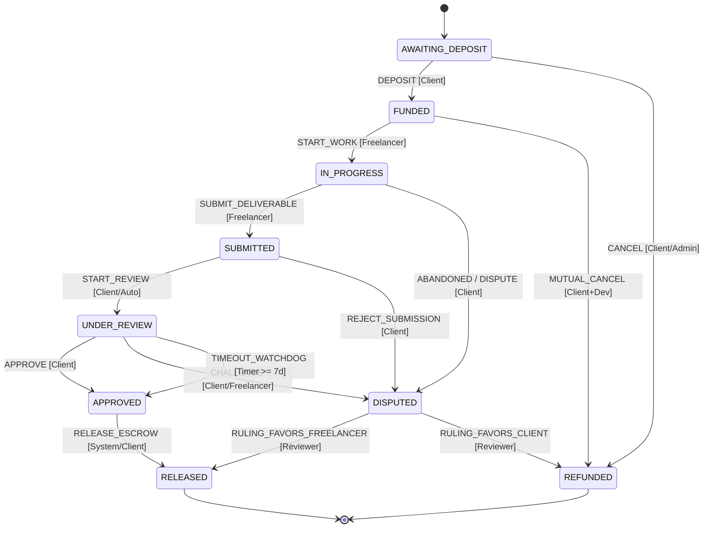

# Escrow Finite State Machine (FSM) Specification

> **Classification**: Authoritative State Machine Specification (Stage S2 — Shared Architecture)
> **Engine Owner**: Engine 01 (OS Engine) — Vaishnavi Modekar
> **Source Documents**:
> - `docs/source-material/Team07_Escrow_Mini_Project_KLE_Theme.pptx` (Slide 8, 12, 16)
> - `docs/source-material/Mini_Project_Gate_0_details_FILLED.docx` (Step 4, 6)
> - `docs/requirements/functional-requirements.md` (FR-01, FR-02, FR-12)
> - `docs/decisions/ADR-005-escrow-fsm.md`

---

## 1. Formal FSM Definition & State Space

The Escrow Finite State Machine is formally defined as a 6-tuple:
$$M = (S, \Sigma, \delta, s_0, F, E)$$

Where:
- $S$ is the finite set of valid states:
  $$S = \{\text{AWAITING\_DEPOSIT}, \text{FUNDED}, \text{IN\_PROGRESS}, \text{SUBMITTED}, \text{UNDER\_REVIEW}, \text{APPROVED}, \text{RELEASED}, \text{REFUNDED}, \text{DISPUTED}\}$$
- $\Sigma$ is the alphabet of trigger actions:
  $$\Sigma = \{\text{DEPOSIT}, \text{START\_WORK}, \text{SUBMIT\_DELIVERABLE}, \text{START\_REVIEW}, \text{APPROVE}, \text{RAISE\_DISPUTE}, \text{TIMEOUT\_WATCHDOG}, \text{RESOLVE\_RELEASE}, \text{RESOLVE\_REFUND}\}$$
- $\delta: S \times \Sigma \to S$ is the state transition function.
- $s_0 = \text{AWAITING\_DEPOSIT}$ is the initial state.
- $F = \{\text{RELEASED}, \text{REFUNDED}\}$ is the set of terminal (absorbing) states.
- $E$ is the set of side effects (ACID balance ledger updates, SHA-256 verification, and audit logging).

---

## 2. Comprehensive State Transition Matrix

The table below exhaustively enumerates all valid transitions. Any transition not explicitly listed is **invalid** and must be rejected with error `INVALID_STATE_TRANSITION` (HTTP 400).

| Current State | Action ($\Sigma$) | Permitted Actor | Preconditions & Guards | Next State | Side Effects & Transaction Boundary |
| :--- | :--- | :--- | :--- | :--- | :--- |
| `AWAITING_DEPOSIT` | `DEPOSIT` | `CLIENT` | Client balance $\ge$ Contract amount; Contract not cancelled | `FUNDED` | Debit client balance; Credit escrow balance; Insert `EscrowTransaction(DEPOSIT)`; Insert `AuditLog`. |
| `AWAITING_DEPOSIT` | `CANCEL` | `CLIENT` \| `ADMIN` | Zero escrow funds locked | `REFUNDED` | Mark contract cancelled; Insert `AuditLog`. |
| `FUNDED` | `START_WORK` | `FREELANCER` | Assigned freelancer matches contract; Escrow funded | `IN_PROGRESS` | Update milestone `startedAt`; Insert `AuditLog`. |
| `FUNDED` | `MUTUAL_CANCEL` | `CLIENT` + `FREELANCER` | Both parties sign cancellation | `REFUNDED` | Debit escrow; Credit client balance; Insert `EscrowTransaction(REFUND)`. |
| `IN_PROGRESS` | `SUBMIT_DELIVERABLE` | `FREELANCER` | Deliverable file non-empty; SHA-256 generated | `SUBMITTED` | Store SHA-256 checksum in `Deliverable`; Update milestone; Insert `AuditLog`. |
| `IN_PROGRESS` | `RAISE_DISPUTE` | `CLIENT` | Missed due date or abandonment | `DISPUTED` | Create `Dispute` record; Freeze contract escrow; Insert `AuditLog`. |
| `SUBMITTED` | `START_REVIEW` | `CLIENT` \| `SYSTEM` | Deliverable present with verified SHA-256 | `UNDER_REVIEW` | Set `reviewDeadline = Now() + 7 days`; Insert `AuditLog`. |
| `SUBMITTED` | `RAISE_DISPUTE` | `CLIENT` | Client rejects work outright | `DISPUTED` | Create `Dispute` record; Freeze escrow; Insert `AuditLog`. |
| `UNDER_REVIEW` | `APPROVE` | `CLIENT` | SHA-256 checksum validated; Client confirms | `APPROVED` | Mark milestone `approvedAt`; Clear review watchdog; Insert `AuditLog`. |
| `UNDER_REVIEW` | `RAISE_DISPUTE` | `CLIENT` \| `FREELANCER` | Defect or disagreement | `DISPUTED` | Create `Dispute` record; Clear review timer; Insert `AuditLog`. |
| `UNDER_REVIEW` | `TIMEOUT_WATCHDOG` | `SYSTEM` (Watchdog) | Elapsed time $\ge 7\text{ days}$ ($T \ge T_{\text{deadline}}$) | `APPROVED` | Auto-approval event; Watchdog escalation logged; Insert `AuditLog`. |
| `APPROVED` | `RELEASE_ESCROW` | `CLIENT` \| `SYSTEM` | Milestone status is `APPROVED`; Escrow balance $> 0$ | `RELEASED` | Debit escrow; Credit freelancer balance; Insert `EscrowTransaction(RELEASE)`. |
| `DISPUTED` | `RULING_RELEASE` | `REVIEWER` | Assigned Reviewer; Ruling: Release to Freelancer | `RELEASED` | Debit escrow; Credit freelancer balance; Close dispute; Insert `AuditLog`. |
| `DISPUTED` | `RULING_REFUND` | `REVIEWER` | Assigned Reviewer; Ruling: Refund to Client | `REFUNDED` | Debit escrow; Credit client balance; Close dispute; Insert `AuditLog`. |

---

## 3. Terminal & Absorbing States

### 3.1 State: `RELEASED`
- **Semantics**: Escrow funds for the milestone/contract have been successfully transferred to the freelancer's wallet balance.
- **Invariants**:
  - `escrowBalance == 0.00`
  - Zero outgoing transitions exist ($\delta(\text{RELEASED}, \sigma) = \emptyset, \forall \sigma \in \Sigma$).
  - Any subsequent mutation attempt returns `TERMINAL_STATE_ERROR`.

### 3.2 State: `REFUNDED`
- **Semantics**: Escrow funds have been returned to the client's wallet balance following cancellation or dispute resolution.
- **Invariants**:
  - `escrowBalance == 0.00`
  - Zero outgoing transitions exist ($\delta(\text{REFUNDED}, \sigma) = \emptyset, \forall \sigma \in \Sigma$).
  - Any subsequent mutation attempt returns `TERMINAL_STATE_ERROR`.

---

## 4. Special Transition Protocols

### 4.1 Watchdog Timer Escalation Protocol (`UNDER_REVIEW` $\to$ `APPROVED`)
- **Background**: Slide 12 of `Team07_Escrow_Mini_Project_KLE_Theme.pptx` mandates timeout mechanics to eliminate freelancer payment starvation. Decision D-02 formally established a default 7-calendar-day window.
- **Watchdog Execution Logic**:
  1. Upon entering `UNDER_REVIEW`, `reviewDeadline` is set to $\text{timestamp} + 7 \times 86400 \times 1000\text{ ms}$.
  2. Every minute, Engine 01's timer watchdog evaluates:
     $$\text{OverdueMilestones} = \{m \in \text{Milestones} \mid m.\text{status} = \text{UNDER\_REVIEW} \land \text{Now}() \ge m.\text{reviewDeadline}\}$$
  3. For each overdue milestone, Engine 01 executes `executeTransition({ action: 'TIMEOUT_WATCHDOG', actor: 'SYSTEM' })`.
  4. The milestone automatically transitions to `APPROVED`, triggering escrow release.
  5. An audit record is created: `action = WATCHDOG_AUTO_APPROVAL`, `notes = "7-day client review timeout expired without objection."`

### 4.2 Dispute Freezing & Arbitration Protocol
- **Trigger**: Either Client or Freelancer calls `POST /api/contracts` with `action: 'RAISE_DISPUTE'`.
- **State Transition**: `*` $\to$ `DISPUTED`.
- **Freeze Invariant**: While in `DISPUTED`, all automatic timers (including review watchdog) are halted. Regular release/refund calls by Client or Freelancer are blocked.
- **Resolution**: Only an assigned Dispute Reviewer (role `REVIEWER`) can transition the dispute out of `DISPUTED` by submitting a signed ruling (`RULING_RELEASE` or `RULING_REFUND`).

---

## 5. Invalid Transitions & Error Mapping

Attempts to execute illegal transitions return standardized HTTP errors:

| Attempted Transition | Failure Reason | Error Code | HTTP Status |
| :--- | :--- | :--- | :--- |
| `AWAITING_DEPOSIT` $\to$ `RELEASED` | Bypassing deposit and delivery | `CANNOT_RELEASE_UNFUNDED` | 400 |
| `FUNDED` $\to$ `RELEASED` | Bypassing deliverable submission | `WORK_NOT_SUBMITTED` | 400 |
| `SUBMITTED` $\to$ `RELEASED` | Bypassing client inspection/approval | `APPROVAL_REQUIRED` | 400 |
| `RELEASED` $\to$ `*` | State is terminal | `TERMINAL_STATE_IMMUTABLE` | 400 |
| `REFUNDED` $\to$ `*` | State is terminal | `TERMINAL_STATE_IMMUTABLE` | 400 |
| Any state $\to$ Any state by unauthorized role | Caller lacks required RBAC role | `UNAUTHORIZED_FSM_ACTOR` | 403 |
| Concurrent transition on same milestone | Mutex lock already held | `STATE_MUTEX_LOCKED` | 409 |
