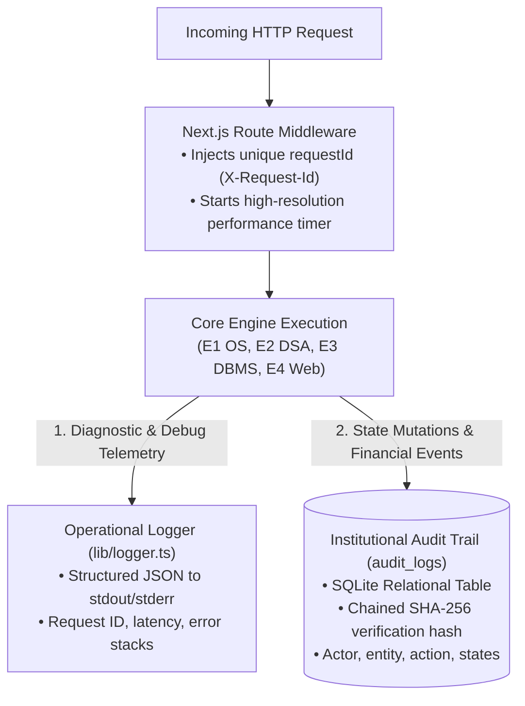

# Observability & Structured Logging Architecture

> **Classification**: Authoritative Observability Specification (Stage S2 — Shared Architecture)
> **Source Documents**:
> - `docs/source-material/Team07_Escrow_Mini_Project_KLE_Theme.pptx` (Slide 14, 16)
> - `docs/requirements/non-functional-requirements.md` (NFR-09)
> - `docs/database/audit-log-design.md`

---

## 1. Observability Architecture & Log Taxonomy

The platform decouples operational diagnostics from institutional compliance through two specialized logging tiers:



---

## 2. Request Correlation & Context Propagation

1. **Correlation Header**: Every incoming HTTP request is checked for `X-Request-Id`. If absent, middleware generates a new UUIDv4 string.
2. **Context Binding**: The `requestId` is attached to:
   - All operational JSON log lines emitted during that execution.
   - The response HTTP header `X-Request-Id`.
   - The metadata block of standard success/error JSON response envelopes.
   - Any `audit_logs` records created as a result of that request.
3. **Traceability**: An auditor or evaluator investigating an error or dispute can take the `requestId` from the client UI toast and find the exact log entries and audit records across the system.

---

## 3. Structured Operational Log Format

All diagnostic logs output strictly formatted JSON strings to standard output:

```json
{
  "timestamp": "2026-10-02T22:30:15.123Z",
  "level": "INFO",
  "service": "engine-01-os",
  "requestId": "req-98f7e21a-uuid",
  "event": "MILESTONE_STATE_TRANSITION",
  "context": {
    "contractId": "c-44e21a-uuid",
    "milestoneId": "m-01-uuid",
    "fromState": "UNDER_REVIEW",
    "toState": "APPROVED",
    "actorId": "usr-client-01",
    "durationMs": 14.2
  }
}
```

---

## 4. Key Performance Telemetry & Metrics

The system monitors critical operational KPIs to ensure adherence to NFRs:

| Metric Name | Measurement Point | Target KPI Threshold | Alert / Escalation Rule |
| :--- | :--- | :--- | :--- |
| `http.request.duration_ms` | Route Handler exit | $\le 500\text{ ms}$ (95th percentile, NFR-01) | Warning if duration $> 1,000\text{ ms}$. |
| `os.mutex.wait_time_ms` | `KeyedMutex.acquire()` | $\le 50\text{ ms}$ | Warning if lock wait time $> 1,000\text{ ms}$. |
| `crypto.hash.duration_ms` | SHA-256 digest stream | $\le 100\text{ ms}$ for 10 MB payload | Warning if hashing $> 250\text{ ms}$. |
| `dbms.tx.duration_ms` | `prisma.$transaction` commit | $\le 150\text{ ms}$ | Warning if transaction lock wait $> 500\text{ ms}$. |
| `watchdog.poll.count` | Timer scheduler tick | Run every 60s; process overdue queue | Error if watchdog tick skips $> 120\text{ s}$. |
