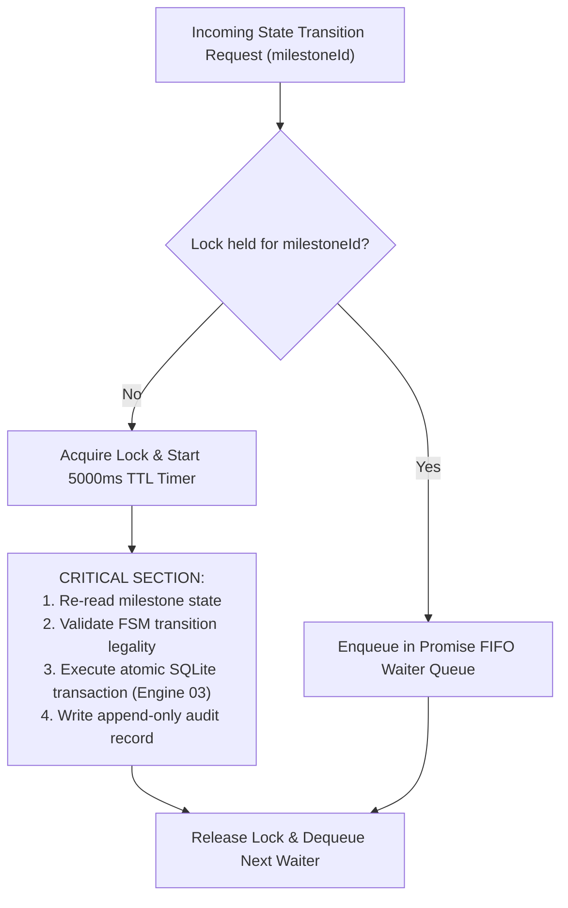
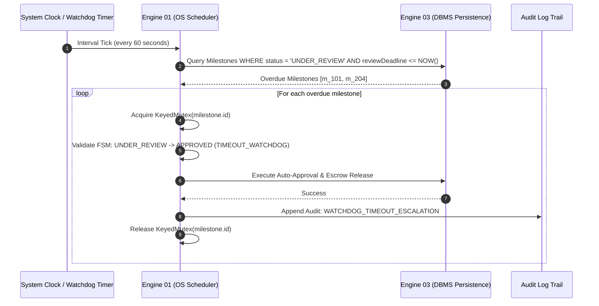

# Operating Systems Engine (Engine 01) Concurrency & Scheduling Architecture

> **Classification**: Authoritative OS & Concurrency Architecture Specification (Stage S2 — Shared Architecture)
> **Engine Owner**: Vaishnavi Modekar (Roll No: 21, SRN: `02FE24BCS060`)
> **Source Documents**:
> - `docs/source-material/Team07_Escrow_Mini_Project_KLE_Theme.pptx` (Slide 12, 16)
> - `docs/requirements/engine-defense/engine-01-os.md`
> - `docs/architecture/escrow-fsm.md`
> - `docs/decisions/ADR-005-escrow-fsm.md`

---

## 1. Academic OS Mapping & Architectural Objectives

Engine 01 applies classical Operating Systems concepts to financial workflow engineering inside a high-throughput modern runtime:

| Classical OS Concept | Engine 01 Implementation in Milestone Escrow Platform |
| :--- | :--- |
| **Process State Model** | Finite State Machine (FSM): `AWAITING_DEPOSIT` $\to$ `FUNDED` $\to$ `IN_PROGRESS` $\to$ `SUBMITTED` $\to$ `UNDER_REVIEW` $\to$ `APPROVED` $\to$ `RELEASED`. |
| **Mutual Exclusion (Mutex)** | In-memory asynchronous `KeyedMutex` locking critical sections per `milestoneId` to serialize concurrent requests. |
| **Race Condition Prevention** | Elimination of Time-of-Check to Time-of-Use (TOCTOU) bugs when concurrent users trigger release vs dispute. |
| **Timer Interrupt / Watchdog** | Background watchdog timer scheduler enforcing the 7-day client review timeout ($T \ge 7\text{ days}$). |
| **Deadlock Avoidance** | Strict monotonic lock acquisition ordering and lock timeouts with fail-safe release. |
| **Atomic Test-and-Set** | Atomic compare-and-swap database state transitions (`UPDATE ... WHERE status = expected`). |

---

## 2. Concurrency Model & Concurrency Hazards

Although the Node.js JavaScript runtime executes user code on a single-threaded event loop, **concurrency hazards arise across asynchronous `await` boundaries**.

```text
Request A (Client: Release Escrow):  [Check Status: APPROVED] --------(await I/O)--------> [Transfer Funds]
                                                                        ^
Request B (Client: Raise Dispute):   -----> [Check Status: APPROVED] -> [Freeze Escrow] -> [Update: DISPUTED]
```

### The Hazard: Time-of-Check to Time-of-Use (TOCTOU)
1. Request A inspects milestone $M$ and sees status `APPROVED`.
2. Request A yields execution to the event loop while initiating a database read.
3. Request B arrives from another tab, checks status `APPROVED`, and raises a dispute, transitioning $M$ to `DISPUTED`.
4. Request A resumes and executes the financial transfer anyway, resulting in **double-spending or releasing funds under active dispute**.

---

## 3. Mutual Exclusion & Critical Section Architecture

To guarantee mutual exclusion across async operations, Engine 01 implements an in-memory asynchronous `KeyedMutex`:



### 3.1 `KeyedMutex` Implementation Design
```typescript
export class KeyedMutex {
  private locks: Map<string, Promise<void>> = new Map();

  async acquire(key: string, timeoutMs = 5000): Promise<() => void> {
    const existingLock = this.locks.get(key) || Promise.resolve();

    let releaseLock: () => void;
    const currentLock = new Promise<void>((resolve) => {
      releaseLock = resolve;
    });

    // Chain the lock
    const acquired = existingLock.then(() => currentLock);
    this.locks.set(key, acquired);

    // Timeout guard to prevent permanent starvation / deadlocks
    const timeoutPromise = new Promise<never>((_, reject) =>
      setTimeout(() => reject(new Error(`Mutex timeout on key: ${key}`)), timeoutMs)
    );

    await Promise.race([existingLock, timeoutPromise]);

    let released = false;
    return () => {
      if (!released) {
        released = true;
        releaseLock();
        if (this.locks.get(key) === acquired) {
          this.locks.delete(key);
        }
      }
    };
  }
}
```

---

## 4. Defense-in-Depth: Atomic Database Compare-and-Swap

In-memory mutexes protect a single Node.js process. To ensure defense-in-depth, Engine 01 couples the memory mutex with an **Atomic Compare-and-Swap (CAS)** query executed by Engine 03:

```sql
UPDATE Milestone
SET
  status = :nextStatus,
  updated_at = CURRENT_TIMESTAMP
WHERE
  id = :milestoneId
  AND status = :expectedCurrentStatus;
```

If the row count returned is `0`, the state was concurrently modified. The transaction immediately rolls back and throws `ConcurrentStateModificationException`.

---

## 5. Review Timeout Watchdog Scheduler

### 5.1 The Starvation Problem
Freelancers submit completed deliverables, but clients fail to inspect or approve them indefinitely. Without a watchdog, freelancer earnings remain locked forever.

### 5.2 Watchdog Timer Architecture
Engine 01 implements a proactive watchdog timer scheduler running as an interval task within the application:



### 5.3 Mathematical Watchdog Condition
A milestone $m$ triggers auto-approval if and only if:
$$\text{CurrentTime} \ge m.\text{submittedAt} + (7 \times 86,400,000\text{ ms})$$
$$\land \quad m.\text{status} = \text{UNDER\_REVIEW}$$
$$\land \quad \text{DisputeExists}(m) = \text{false}$$

---

## 6. Deadlock Prevention Strategy

Deadlocks could theoretically occur if an operation required locking two milestones simultaneously (e.g. multi-milestone contract restructuring).

Engine 01 enforces Dijkstra's **Monotonic Resource Hierarchy**:
1. If multiple locks must be acquired, they must be acquired in **lexicographical order of their UUID strings**:
   $$\text{Lock}(id_A) \text{ then } \text{Lock}(id_B) \iff id_A < id_B$$
2. Circular wait is mathematically impossible because all processes request locks in identical ascending order.
3. Every lock has a mandatory **5,000 ms time-to-live (TTL)** timeout, guaranteeing that abandoned locks automatically release.
