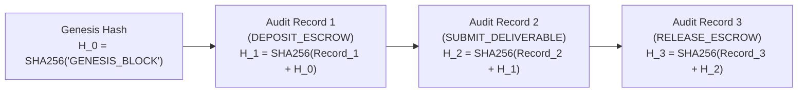

# Append-Only Audit Log Architecture & Design

> **Classification**: Authoritative Institutional Audit Trail Specification (Stage S2 — Shared Architecture)
> **Engine Owner**: Engine 03 (DBMS Engine) — Purvi Sammatshetti
> **Source Documents**:
> - `docs/source-material/Team07_Escrow_Mini_Project_KLE_Theme.pptx` (Slide 14, 18)
> - `docs/requirements/functional-requirements.md` (FR-06)
> - `docs/requirements/non-functional-requirements.md` (NFR-09)
> - `docs/decisions/ADR-007-database-transactions.md`

---

## 1. Audit Trail Purpose & Separation of Concerns

The platform strictly differentiates between two fundamentally distinct types of logging:

1. **Operational Logs (Diagnostic / Telemetry)**:
   - Ephemeral, stdout/stderr JSON streams managed by the application logger.
   - Used for debugging, network traces, request durations, and server error diagnostics.
   - Retention: Volatile, rotated, not cryptographically verifiable.
2. **Academic & Institutional Audit Logs (`AUDIT_LOG`)**:
   - Durable, tamper-resistant relational database records stored in SQLite.
   - Captures every state-modifying action affecting funds, contracts, deliverables, or disputes.
   - Protected by cryptographic SHA-256 verification hash chaining.
   - Retention: Permanent, immutable, accessible to Auditors and Administrators.

---

## 2. Cryptographic Hash-Chaining Architecture

To prevent retroactive tampering, reordering, or deletion of audit records by rogue operators or compromised database accounts, `audit_logs` implements **Merkle-Damgård Cryptographic Hash Chaining**:



### Mathematical Formulation
$$\text{Payload}(i) = \text{actorId}_i \parallel \text{entityName}_i \parallel \text{entityId}_i \parallel \text{action}_i \parallel \text{newState}_i \parallel \text{timestamp}_i$$
$$H_i = \text{SHA256}(\text{Payload}(i) \parallel H_{i-1})$$

If an attacker alters the state payload of `Record 2` directly via SQL injection or raw file editing, recomputing the chain reveals an immediate hash mismatch at $H_2$, invalidating all subsequent records $H_3 \dots H_n$.

---

## 3. Schema & Immutability Enforcement

```sql
CREATE TABLE audit_logs (
    id VARCHAR(36) PRIMARY KEY,
    actor_id VARCHAR(36) NOT NULL,
    entity_name VARCHAR(50) NOT NULL,
    entity_id VARCHAR(36) NOT NULL,
    action VARCHAR(50) NOT NULL,
    previous_state TEXT,
    new_state TEXT NOT NULL,
    prev_hash VARCHAR(64) NOT NULL,
    verification_hash VARCHAR(64) NOT NULL,
    timestamp DATETIME NOT NULL DEFAULT CURRENT_TIMESTAMP
);

-- Database-level immutability triggers (SQLite)
CREATE TRIGGER prevent_audit_log_update
BEFORE UPDATE ON audit_logs
BEGIN
    SELECT RAISE(ABORT, 'MUTATION FORBIDDEN: audit_logs is append-only.');
END;

CREATE TRIGGER prevent_audit_log_delete
BEFORE DELETE ON audit_logs
BEGIN
    SELECT RAISE(ABORT, 'DELETION FORBIDDEN: audit_logs records cannot be deleted.');
END;
```

---

## 4. Captured Audit Actions Catalog

Every state transition and financial movement triggers a mandatory audit entry:

| Event Code | Action Name | Actor | Entity | Captured Metadata |
| :--- | :--- | :--- | :--- | :--- |
| `AUDIT_01` | `POST_PROJECT` | Client | `Project` | Title, budget, initial skill tags. |
| `AUDIT_02` | `SUBMIT_PROPOSAL` | Freelancer | `Proposal` | Bid amount, cover letter hash, initial AI match score. |
| `AUDIT_03` | `ACCEPT_PROPOSAL` | Client | `Contract` | Formation of contract, agreed total amount. |
| `AUDIT_04` | `DEPOSIT_ESCROW` | Client | `Contract` | Amount debited, transition to `FUNDED`. |
| `AUDIT_05` | `START_WORK` | Freelancer | `Milestone` | Transition to `IN_PROGRESS`. |
| `AUDIT_06` | `SUBMIT_DELIVERABLE`| Freelancer | `Deliverable` | File URL, immutable SHA-256 checksum. |
| `AUDIT_07` | `APPROVE_MILESTONE` | Client | `Milestone` | Client verification confirmation. |
| `AUDIT_08` | `WATCHDOG_AUTO_APPROVAL`| System | `Milestone` | 7-day timeout expiration without objection. |
| `AUDIT_09` | `RELEASE_ESCROW` | Client/System | `Milestone` | Payout released to freelancer wallet. |
| `AUDIT_10` | `RAISE_DISPUTE` | Client/Dev | `Dispute` | Claim narrative, disputed milestone ID. |
| `AUDIT_11` | `ARBITRATION_RULING` | Reviewer | `Dispute` | Final binding verdict and written reasoning. |

---

## 5. Audit Access Control & Verification API

1. **Role-Based Authorization**:
   - `GET /api/audit-logs`: Restricted to `ADMIN` and institutional evaluators.
   - `GET /api/contracts/{id}/audit`: Restricted to verified parties to that contract (`CLIENT` or `FREELANCER`).
2. **Integrity Verification Routine (`verifyAuditChain()`)**:
   - Traverses the entire audit log table in ascending timestamp order.
   - Recomputes $H_i = \text{SHA256}(\text{Payload}_i \parallel H_{i-1})$.
   - Returns a cryptographically signed verification certificate:
     ```json
     {
       "valid": true,
       "totalRecords": 142,
       "firstRecordTimestamp": "2026-10-02T10:00:00Z",
       "lastRecordTimestamp": "2026-10-02T22:30:00Z",
       "merkleRoot": "7f8b9c...a1b2",
       "tamperingDetected": false
     }
     ```
