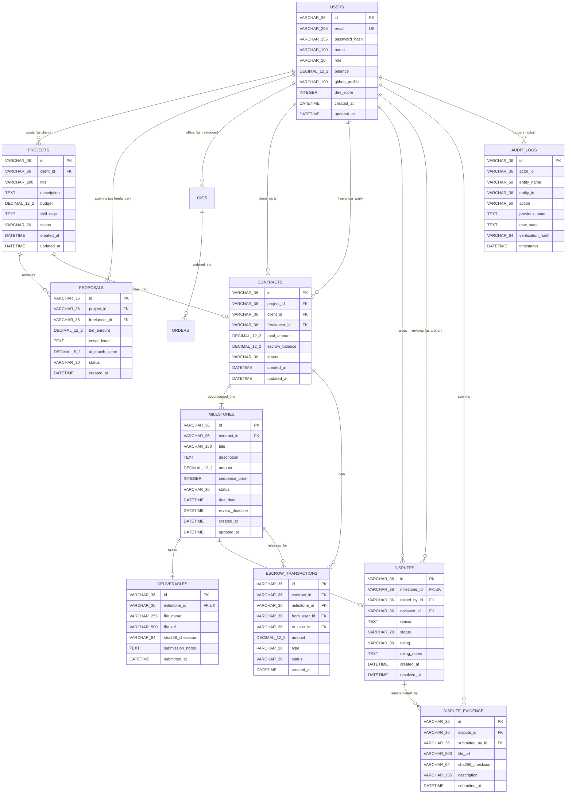

# Entity-Relationship (ER) Model Specification

> **Classification**: Authoritative Database ER Model Specification (Stage S2 — Shared Architecture)
> **Engine Owner**: Engine 03 (DBMS Engine) — Purvi Sammatshetti
> **Source Documents**:
> - `docs/source-material/Team07_Escrow_Mini_Project_KLE_Theme.pptx` (Slide 14, 16)
> - `docs/database/schema.md`
> - `docs/decisions/ADR-007-database-transactions.md`

---

## 1. Visual Entity-Relationship Diagram

---

## 2. Cardinality & Relationship Semantics

| Primary Entity | Foreign Entity | Cardinality | Business Rule / Referential Integrity Policy |
| :--- | :--- | :---: | :--- |
| `USERS` | `PROJECTS` | `1 : N` | A client can post multiple projects; a project has exactly one posting client. `ON DELETE RESTRICT`. |
| `PROJECTS` | `PROPOSALS` | `1 : N` | A project receives multiple freelancer proposals. `ON DELETE CASCADE`. |
| `USERS` | `PROPOSALS` | `1 : N` | A freelancer can submit proposals to multiple projects, but only 1 per project (`UNIQUE(project_id, freelancer_id)`). |
| `PROJECTS` | `CONTRACTS` | `1 : 1` | When a client accepts a proposal, exactly one binding contract is formed from that project. `ON DELETE RESTRICT`. |
| `CONTRACTS` | `MILESTONES` | `1 : N` | A contract is decomposed into 1 or more sequential milestones ($\ge 1$). `ON DELETE RESTRICT`. |
| `MILESTONES` | `DELIVERABLES`| `1 : 1` | A milestone has at most one active verified submission deliverable (`UNIQUE(milestone_id)`). `ON DELETE RESTRICT`. |
| `MILESTONES` | `DISPUTES` | `1 : 1` | A milestone can have at most one active dispute at any given time. `ON DELETE RESTRICT`. |
| `DISPUTES` | `DISPUTE_EVIDENCE`| `1 : N`| A dispute accumulates multiple evidence items from both claimant and respondent. `ON DELETE CASCADE`. |
| `CONTRACTS` | `ESCROW_TRANSACTIONS`| `1 : N`| A contract accumulates an append-only sequence of deposit, lock, release, and refund ledger entries. |
| `ANY` | `AUDIT_LOGS` | `1 : N` | State-modifying actions append immutable audit rows. Zero foreign key cascade deletions allowed. |
