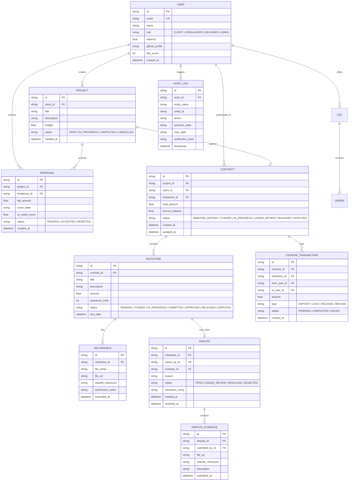

# Database Architecture & Schema Specification

> **Classification**: Database Management Systems Engine Specification (Engine 03)
> **Engine Owner**: Purvi Sammatshetti (Roll No: 11, SRN: `02FE24BCS022`)
> **Database Engine**: SQLite with Prisma 5.22 ORM
> **Source Documents**:
> - `docs/source-material/Team07_Escrow_Mini_Project_KLE_Theme.pptx` (Slides 14, 16, 17)
> - `docs/decisions/ADR-001-technology-stack-baseline.md`

---

## 1. Persistence Strategy & ACID Principles
The database layer manages all relational data entities in BCNF-normalized tables, executes atomic transactions for financial escrow ledger state transitions, and maintains an append-only audit trail for dispute transparency.

- **ORM**: Prisma 5.22
- **Relational Storage**: SQLite (local embedded engine with zero-configuration overhead)
- **Transactions**: Atomic `prisma.$transaction()` blocks for all escrow balance modifications
- **Integrity**: Foreign key cascading rules, unique constraints, and parameterized queries

---

## 2. Core Entity Relationship Model (ERD)

---

## 3. Database Migration & Schema Hygiene
1. **Schema Definition**: Expressed in `prisma/schema.prisma`.
2. **Deterministic Seed Scripts**: Provide baseline mock data for Clients, Freelancers, Reviewers, and sample Projects for local evaluation (`prisma/seed.ts`).
3. **Audit Trail Immutability**: The `AUDIT_LOG` table is append-only; update and delete operations on audit records are forbidden.
