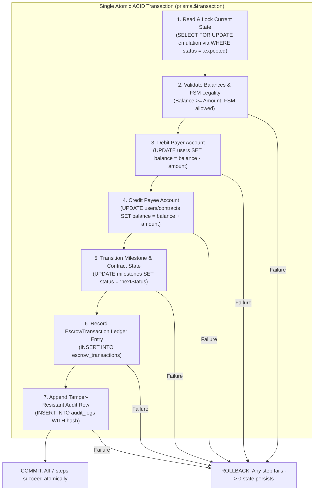

# Database ACID Transaction Architecture & Ledger Design

> **Classification**: Authoritative Transaction Architecture Specification (Stage S2 — Shared Architecture)
> **Engine Owner**: Engine 03 (DBMS Engine) — Purvi Sammatshetti
> **RDBMS**: SQLite 3 (WAL Mode) via Prisma ORM 5.22
> **Source Documents**:
> - `docs/source-material/Team07_Escrow_Mini_Project_KLE_Theme.pptx` (Slide 14, 16)
> - `docs/requirements/functional-requirements.md` (FR-05, FR-06)
> - `docs/requirements/non-functional-requirements.md` (NFR-08, NFR-09)
> - `docs/decisions/ADR-007-database-transactions.md`

---

## 1. Transaction Principles & ACID Implementation

In financial escrow systems, partial state mutations are catastrophic. If a client's wallet is debited but the contract escrow balance fails to update, funds disappear. If escrow is released to a freelancer but the milestone status remains `APPROVED`, funds can be withdrawn repeatedly.

To eliminate financial anomalies, the platform mandates that every financial state transition occurs within a **Single Atomic ACID Transaction Boundary** (`prisma.$transaction`).

---

## 2. Step-by-Step Escrow Lifecycle Transactions

### 2.1 Deposit & Escrow Funding Transaction (`DEPOSIT`)
- **Trigger**: Client funds a newly formed contract.
- **Atomic Operations within Transaction**:
  1. **Read & Check**: Read `User` where `id = :clientId`. Assert `balance >= contract.totalAmount`.
  2. **Read & Check**: Read `Contract` where `id = :contractId`. Assert `status == 'AWAITING_DEPOSIT'`.
  3. **Debit Client**: `UPDATE users SET balance = balance - :amount WHERE id = :clientId AND balance >= :amount`. Verify 1 row affected.
  4. **Credit Escrow**: `UPDATE contracts SET escrow_balance = escrow_balance + :amount, status = 'FUNDED' WHERE id = :contractId AND status = 'AWAITING_DEPOSIT'`. Verify 1 row affected.
  5. **Update Milestones**: `UPDATE milestones SET status = 'FUNDED' WHERE contract_id = :contractId AND sequence_order = 1`.
  6. **Insert Ledger**: `INSERT INTO escrow_transactions (type: 'DEPOSIT', amount: :amount, from_user_id: :clientId, to_user_id: NULL, status: 'COMPLETED')`.
  7. **Append Audit**: `INSERT INTO audit_logs (action: 'DEPOSIT_ESCROW', entity: 'Contract', new_state: 'FUNDED', hash: SHA256(...))`.
- **Conservation Check**: $\Delta\text{balance}_{\text{client}} (-\text{amount}) + \Delta\text{balance}_{\text{escrow}} (+\text{amount}) = 0$.

---

### 2.2 Milestone Escrow Release Transaction (`RELEASE_ESCROW`)
- **Trigger**: Client approves milestone, or Reviewer resolves dispute in favor of freelancer, or 7-day watchdog timer expires.
- **Atomic Operations within Transaction**:
  1. **Read & Check**: Read `Milestone` where `id = :milestoneId`. Assert `status == 'APPROVED'` (or `DISPUTED` with signed ruling).
  2. **Read & Check**: Read `Contract` where `id = :contractId`. Assert `escrow_balance >= milestone.amount`.
  3. **Debit Escrow**: `UPDATE contracts SET escrow_balance = escrow_balance - :amount WHERE id = :contractId AND escrow_balance >= :amount`. Verify 1 row affected.
  4. **Credit Freelancer**: `UPDATE users SET balance = balance + :amount WHERE id = :freelancerId`.
  5. **Transition Milestone**: `UPDATE milestones SET status = 'RELEASED' WHERE id = :milestoneId AND status = :currentStatus`. Verify 1 row affected.
  6. **Update Contract If Complete**: If all milestones are `RELEASED`, set `Contract.status = 'RELEASED'`.
  7. **Insert Ledger**: `INSERT INTO escrow_transactions (type: 'RELEASE', amount: :amount, from_user_id: NULL, to_user_id: :freelancerId, status: 'COMPLETED')`.
  8. **Append Audit**: `INSERT INTO audit_logs (action: 'RELEASE_ESCROW', entity: 'Milestone', new_state: 'RELEASED', hash: SHA256(...))`.
- **Conservation Check**: $\Delta\text{balance}_{\text{escrow}} (-\text{amount}) + \Delta\text{balance}_{\text{freelancer}} (+\text{amount}) = 0$.

---

### 2.3 Milestone Escrow Refund Transaction (`REFUND_ESCROW`)
- **Trigger**: Mutual contract cancellation or dispute ruling in favor of client.
- **Atomic Operations within Transaction**:
  1. **Read & Check**: Assert `Contract.escrow_balance >= :amount`.
  2. **Debit Escrow**: `UPDATE contracts SET escrow_balance = escrow_balance - :amount WHERE id = :contractId AND escrow_balance >= :amount`.
  3. **Credit Client**: `UPDATE users SET balance = balance + :amount WHERE id = :clientId`.
  4. **Transition Milestone & Contract**: Set status to `REFUNDED`.
  5. **Insert Ledger**: `INSERT INTO escrow_transactions (type: 'REFUND', amount: :amount, from_user_id: NULL, to_user_id: :clientId, status: 'COMPLETED')`.
  6. **Append Audit**: `INSERT INTO audit_logs (action: 'REFUND_ESCROW', entity: 'Milestone', new_state: 'REFUNDED', hash: SHA256(...))`.
- **Conservation Check**: $\Delta\text{balance}_{\text{escrow}} (-\text{amount}) + \Delta\text{balance}_{\text{client}} (+\text{amount}) = 0$.

---

## 3. Anomaly Prevention Proofs

### 3.1 Double-Allocation Prevention
- **Hazard**: Two concurrent deposit requests submitted simultaneously for the same contract.
- **Prevention**: Step 4 checks `WHERE id = :contractId AND status = 'AWAITING_DEPOSIT'`. The first transaction transitions status to `FUNDED`. The second transaction matches 0 rows, triggering an immediate exception and rolling back all operations.

### 3.2 Partial-Release Prevention
- **Hazard**: Server crashes or network drops after crediting the freelancer's account but before marking the milestone `RELEASED`.
- **Prevention**: SQLite's Write-Ahead Log (WAL) ensures atomic atomicity. If power fails or the process crashes mid-transaction, SQLite's recovery engine discards the uncommitted WAL frames upon restart. The freelancer account is never credited without the milestone status update.

### 3.3 Missing Audit Event Prevention
- **Hazard**: A developer modifies a milestone state directly in the database without creating a corresponding audit log row.
- **Prevention**: The application architecture funnels all mutations through Engine 03's `IDbmsLedgerEngine`, which mandates audit record creation as step 7 inside the identical `prisma.$transaction`. If audit record creation fails (e.g. unique constraint violation on chained hash), the entire financial transfer aborts.

---

## 4. SQLite WAL Mode Concurrency Characteristics

1. **Write-Ahead Logging (WAL)**:
   - Readers do not block writers.
   - Writers do not block readers.
   - Queries reading data read committed snapshots from the database file and completed WAL frames.
2. **Single-Writer Serialization**:
   - SQLite enforces a single writer lock at any instant.
   - If two write transactions attempt to write concurrently, SQLite returns `SQLITE_BUSY`.
   - **Mitigation Strategy**:
     - Prisma client configured with `busy_timeout = 5000` (waits up to 5 seconds for write lock).
     - Engine 03 wraps transaction attempts with a jittered exponential backoff retry loop (up to 3 retries) before raising a transient concurrency error.
