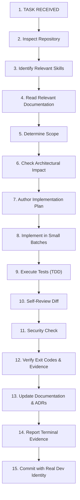

# AI Agent Development Protocol

> **Governing Operating Procedure for AI Agents in BIG_PROJECT**

## 1. Core Mandate
AI agents operating in this repository must function as disciplined senior software engineers, never as speculative autocomplete engines. Agents are prohibited from jumping directly from user prompt to massive code generation without inspection, research, planning, testing, and evidence-backed verification.

---

## 2. The 15-Step Execution Protocol

---

## 3. Protocol Stage Details

### Step 1: Task Received
Acknowledge the core objective and identify constraints.

### Step 2: Inspect Repository
Run read commands (`view_file`, directory listings, git status) to understand existing code, interfaces, and patterns.

### Step 3: Identify Relevant Skills
Match task requirements against skills in `.agents/skills/` and active Antigravity plugins.

### Step 4: Read Relevant Documentation
Consult `docs/architecture/`, `docs/requirements/`, and `docs/decisions/` to respect existing system boundaries.

### Step 5: Determine Scope
Identify precisely which files must change and which files must NOT be touched. Keep blast radius minimal.

### Step 6: Check Architectural Impact
If introducing a new external dependency, schema alteration, or cross-cutting concern, draft an ADR.

### Step 7: Author Implementation Plan
Formulate small, discrete steps with explicit verification checkpoints.

### Step 8: Implement in Small Batches
Avoid monolithic edits. Implement smallest functional increments.

### Step 9: Execute Tests (TDD)
Write reproduction tests for bug fixes or specification tests for new features. Ensure tests pass cleanly.

### Step 10: Self-Review Diff
Review `git diff` with adversarial scrutiny:
- Are there unnecessary formatting changes?
- Are there dead code paths or debug logs?
- Is backwards compatibility preserved?

### Step 11: Security Check
Run `./scripts/security-check` and verify against `SECURITY.md`.

### Step 12: Verify Exit Codes & Evidence
Run `./scripts/verify` or corresponding test commands. Capture terminal output.

### Step 13: Update Documentation & ADRs
Update `docs/development/project-status.md` and relevant technical specs.

### Step 14: Report Terminal Evidence
Deliver concise completion summary to the engineer with exact commands and verification evidence. Never claim success without proof.

### Step 15: Commit with Real Dev Identity & Zero AI Attribution
Follow the mandatory Git Commit Policy:
- Commits must use Conventional Commits (`feat:`, `fix:`, `refactor:`, `test:`, `docs:`, `chore:`, etc.).
- Never mention AI, agents, models, or automated tooling in commit messages or footers.
- Always commit under the repository's configured real developer identity (`user.name` and `user.email`).

