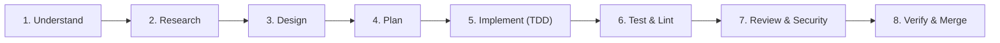

# Engineering & Development Process

> **Standard Operating Procedure for Engineering & AI Orchestration**

## 1. Overview
This project enforces a disciplined, test-driven, and review-gated engineering methodology. No unverified or untested code is permitted into the primary codebase.

---

## 2. The 8-Stage Development Lifecycle



### Stage 1: Understand
- Clarify requirements, user intent, inputs, and outputs.
- Identify edge cases, constraints, and dependencies.

### Stage 2: Research
- Inspect existing codebase patterns, libraries, and utilities.
- Avoid reinventing existing abstractions.

### Stage 3: Design
- Define component boundaries, contracts, and schema changes.
- If architectural or breaking, document in an ADR (`docs/decisions/`).

### Stage 4: Plan
- Break down the task into small, reviewable milestones.
- Identify risks and verification gates.

### Stage 5: Implement (TDD)
- Write unit/integration tests establishing expected failure before implementation.
- Write minimal, focused code to pass the tests.

### Stage 6: Test & Lint
- Execute local test suites, linters, formatters, and type checkers.
- Zero warnings, zero errors.

### Stage 7: Review & Security
- Inspect `git diff` as an adversarial reviewer.
- Check against security checklist: zero secrets, validated input, sanitized output.

### Stage 8: Verify & Merge
- Document terminal commands, exit codes, and test evidence.
- Open pull request using the standard template.

---

## 3. Worktree Strategy for Parallel Work
For non-trivial features:
```bash
git worktree add ../BIG_PROJECT-feature-branch -b feature/<task-name>
```
Complete and verify work in the isolated tree, submit PR, and cleanly prune the worktree upon merge:
```bash
git worktree remove ../BIG_PROJECT-feature-branch
```
