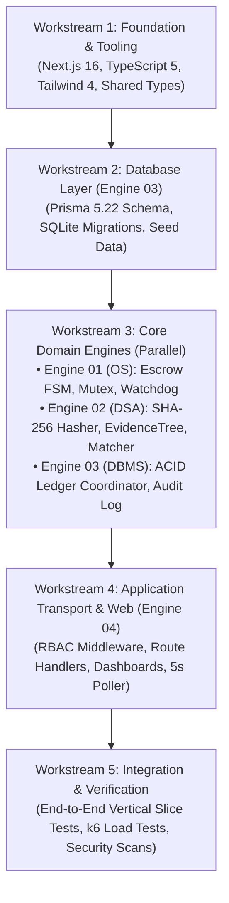

# Stage S3 Implementation Blueprint & Engineering Roadmap

> **Classification**: Authoritative Engineering Roadmap & Workstream Plan (Stage S2 $\to$ Stage S3)
> **Baseline Contract**: Stage S2 Shared Architecture (`docs/architecture/`)
> **Source Documents**:
> - `docs/source-material/Team07_Escrow_Mini_Project_KLE_Theme.pptx`
> - `docs/source-material/Mini_Project_Gate_0_details_FILLED.docx`
> - `docs/architecture/s2-architecture-review.md`

---

## 1. Implementation Philosophy & Stage S3 Boundary Discipline

Stage S3 executes the physical construction of the codebase following strict **Test-Driven Development (TDD)** discipline (Red $\to$ Green $\to$ Refactor).
- **Architecture as Law**: Developers and implementation agents must strictly adhere to the contracts established in Stage S2. No implementation may invent new routes, modify FSM states, or bypass transaction boundaries without an approved ADR.
- **Dependency-Aware Progression**: S3 progress follows a layered dependency graph where foundational layers are verified before higher-level orchestrators are built.

---

## 2. Dependency-Aware Workstream Breakdown

### Workstream 1: Foundation, Tooling & Shared Schemas
- **Objective**: Establish the development workspace, compilation pipeline, and shared type system.
- **Tasks**:
  1. Scaffold Next.js 16 App Router application skeleton in root directory.
  2. Configure `tsconfig.json` with strict type checking (`strict: true`, path aliases `@/core/*`, `@/lib/*`, `@/types/*`).
  3. Configure Tailwind CSS 4 and Lucide Icons.
  4. Implement standard error envelopes and domain exceptions (`lib/errors.ts`).
  5. Implement shared Zod 4 schemas matching `docs/api/openapi.yaml` (`lib/validation/index.ts`).
- **Parallelism**: Sequential foundation; blocks all subsequent workstreams.

---

### Workstream 2: Database Persistence Layer (Engine 03 · Purvi Sammatshetti)
- **Objective**: Implement the relational persistence layer in exact conformance with `docs/database/schema.md`.
- **Tasks**:
  1. Author `prisma/schema.prisma` mapping all 10 normalized tables.
  2. Generate SQLite migration scripts (`prisma migrate dev`).
  3. Configure SQLite WAL mode (`PRAGMA journal_mode = WAL;`) and busy timeout.
  4. Create deterministic database seeder (`prisma/seed.ts`) populating sample Clients, Freelancers, Reviewers, and open Projects for evaluation.
  5. Create Prisma database singleton (`lib/db.ts`).
- **Verification Gate**: Database seeds cleanly; all tables match BCNF specifications.

---

### Workstream 3: Core Domain Engines (Parallel Tracks)
Once Workstream 2 delivers the typed Prisma models, the core algorithmic engines can be implemented **concurrently** in isolated workstreams:

#### Track 3A: Engine 01 (OS Engine · Vaishnavi Modekar)
- **Tasks**:
  1. Implement `KeyedMutex` asynchronous lock (`core/engine-01-os/mutex.ts`).
  2. Implement authoritative `EscrowFsmValidator` (`core/engine-01-os/escrow-fsm.ts`).
  3. Implement `WatchdogScheduler` interval service (`core/engine-01-os/watchdog.ts`).
  4. Unit tests: Verify full transition matrix, lock contention, and 7-day timeout watchdog triggers.

#### Track 3B: Engine 02 (DSA & SE Engine · Darshan Kittur)
- **Tasks**:
  1. Implement streaming `Sha256Hasher` using `node:crypto` (`core/engine-02-dsa-se/hasher.ts`).
  2. Implement in-memory N-ary `EvidenceTreeManager` with $O(V+E)$ Merkle hash calculation (`core/engine-02-dsa-se/evidence-tree.ts`).
  3. Implement deterministic heuristic matcher formula combining Jaccard set similarity and DevScore weighting (`core/engine-02-dsa-se/matcher.ts`).
  4. Unit tests: Cryptographic hash test vectors, tree tampering detection, and mathematical score reproducibility.

#### Track 3C: Engine 03 (DBMS Engine · Purvi Sammatshetti)
- **Tasks**:
  1. Implement `LedgerCoordinator` executing 7-step atomic transactions inside `prisma.$transaction` (`core/engine-03-dbms/ledger.ts`).
  2. Implement `ContractRepository` for milestone and deliverable CRUD (`core/engine-03-dbms/contract-manager.ts`).
  3. Implement `AuditLogger` with cryptographic verification hash chaining (`core/engine-03-dbms/audit-logger.ts`).
  4. Unit tests: Balance conservation $\sum \Delta B = 0$, rollback on simulated crash, and audit chain verification.

---

### Workstream 4: Application Transport & Web Dashboards (Engine 04 · Vaibhav Chavanpatil)
- **Objective**: Wire REST route handlers and render multi-role responsive client dashboards.
- **Tasks**:
  1. Implement server-side RBAC middleware and session validator (`core/engine-04-web/rbac.ts`).
  2. Implement Next.js Server Route Handlers (`app/api/*`) wiring Core Contract Action Protocol (`POST /api/contracts`).
  3. Implement responsive multi-role dashboards:
     - Client Dashboard: Project posting, proposal ranking inspector, escrow deposit modal, deliverable review.
     - Freelancer Dashboard: Project browsing, proposal submission, deliverable file upload with SHA-256 generation.
     - Reviewer Console: Dispute queue, N-ary EvidenceTree visualization, binding ruling submission.
     - Admin / Auditor Panel: System health telemetry, append-only audit trail inspector.
  4. Implement 5-second polling state synchronization engine (`core/engine-04-web/poller.ts`).

---

### Workstream 5: Integration, Security & Performance Verification
- **Objective**: Comprehensive end-to-end verification against all S1 requirements and NFR targets.
- **Tasks**:
  1. End-to-end integration tests: Complete lifecycle walkthrough (Post $\to$ Bid $\to$ Accept $\to$ Deposit $\to$ Submit $\to$ Review $\to$ Release/Dispute).
  2. Security penetration tests: Role spoofing (asserting HTTP 403), file tampering detection, SQLi/XSS fuzzing.
  3. Concurrency stress tests: 50 concurrent transactions asserting zero balance drift.
  4. Performance benchmark: Verify $P_{95} \le 500\text{ ms}$ under 50 simulated users (NFR-01).
  5. Full verification gate execution (`./scripts/verify`).

---

## 3. Multi-Agent Orchestration & Role Governance

During Stage S3, specialized engineering roles will be mobilized according to strict engine boundaries:

| Orchestration Role | Student Counterpart / Focus | Primary Assignment & File Boundaries |
| :--- | :--- | :--- |
| **Principal Orchestrator** | Team 07 Lead | Overall coordination, merge gate enforcement, verification runs. |
| **E1 OS Engineer** | Vaishnavi Modekar | `src/core/engine-01-os/*`, FSM unit tests, concurrency benchmarks. |
| **E2 DSA/SE Engineer** | Darshan Kittur | `src/core/engine-02-dsa-se/*`, EvidenceTree tests, matcher algorithms. |
| **E3 DBMS Engineer** | Purvi Sammatshetti | `prisma/*`, `src/core/engine-03-dbms/*`, ACID ledger tests. |
| **E4 Web Engineer** | Vaibhav Chavanpatil | `src/app/*`, `src/core/engine-04-web/*`, RBAC, UI forms. |
| **Security Reviewer** | Security Gate | DevSecOps audit, STRIDE penetration tests, secret scanning. |
| **Test Engineer** | QA Gate | Integration test suites, k6 performance scripts, coverage audit ($\ge 80\%$). |

---

## 4. Stage S3 Definition of Done (DoD)

A feature or workstream in Stage S3 is marked **Complete** if and only if:
1. **Compilation**: Zero TypeScript compilation errors (`tsc --noEmit`).
2. **Linting**: Zero ESLint or whitespace errors (`scripts/lint` passes with exit code 0).
3. **Automated Tests**: Unit and integration test suites pass with $\ge 80\%$ statement coverage.
4. **Security Check**: Passes `./scripts/security-check` with zero exposed secrets or vulnerabilities.
5. **Architectural Traceability**: Conforms to the contracts defined in `docs/architecture/`.
6. **Full Verification Gate**: `./scripts/verify` completes with code `0`.
