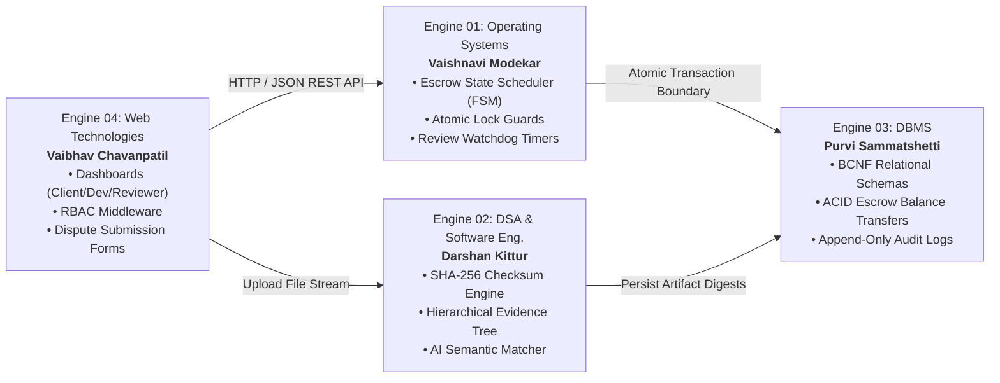

# Gate 1 Adversarial Review & Requirements Defensibility Report

> **Review Authority**: Gate 1 Requirements Review Board
> **Academic Institution**: KLE Technological University's Dr. M. S. Sheshgiri College of Engineering and Technology, Belagavi
> **Department**: Department of Computer Science and Engineering
> **Curriculum Model**: Engine-Based Mini-Project Framework with Hybrid SDLC
> **Project Title**: Milestone-Based Escrow & Evidence-Based Dispute Resolution Workflow
> **Team**: Team 07 (Theme 01)
> **Team Roster**:
> - Vaibhav Chavanpatil (Roll No: 4, SRN: `02FE24BCS013`) — Web Technologies Engine Owner
> - Purvi Sammatshetti (Roll No: 11, SRN: `02FE24BCS022`) — DBMS Engine Owner
> - Darshan Kittur (Roll No: 18, SRN: `02FE24BCS053`) — DSA & Software Engineering Engine Owner
> - Vaishnavi Modekar (Roll No: 21, SRN: `02FE24BCS060`) — Operating Systems Engine Owner
> **Review Date**: 2026-10-02
> **Current Phase**: `PHASE 1: REQUIREMENTS ENGINEERING & GATE 1 PREPARATION`

---

## 1. Overall Assessment

### Gate 1 Readiness Verdict: **CONDITIONAL PASS (READY FOR DEFENSE SUBJECT TO MINOR SPECIFICATION HARDENING)**

The requirements package for Team 07 exhibits high structural maturity, clear scope boundaries, strong stakeholder traceability, and explicit engine decomposition aligned with the department's hybrid SDLC.

The team has successfully avoided common student pitfalls:
- No premature UI code or database tables have been submitted for Gate 1.
- In-scope and out-of-scope boundaries are clearly defined (real financial gateways and autonomous AI rulings are explicitly excluded).
- Requirements trace back to Stage S0 stakeholder pain points.

However, an adversarial university review reveals **3 Major Ambiguities** and **2 Team Decisions** that must be hardened before the team faces external evaluators:
1. **Dual Engine Ownership on FR-11 (AI Semantic Matching)** violates the single-primary-owner academic rule.
2. **Vague "Real-Time" UI terminology in FR-10** without a defined transport mechanism (REST vs Polling vs WebSockets).
3. **Unspecified In-Memory Data Structure for the DSA "Evidence Tree" (FR-04)** exposing Darshan Kittur to algorithmic scrutiny.

Once these clarifications are registered in the derived documentation, the package is defensible for Gate 1 evaluation.

---

## 2. Summary of Findings

| Severity | Count | Summary of Items |
| :--- | :--- | :--- |
| **CRITICAL** | **0** | No disqualifying blockers. Scope, stack, and engines are grounded in source materials. |
| **MAJOR** | **3** | Dual ownership on FR-11; undefined "real-time" transport in FR-10; missing DSA tree algorithm specification in FR-04. |
| **MINOR** | **2** | Undefined test workload for NFR-01; undefined default client review timeout duration in FR-02. |
| **OBSERVATION** | **2** | Subjective terminology ("secure", "intelligent") in introductory sections; SQLite write concurrency limits under load. |

---

## 3. Detailed Findings & Classifications

### Finding 1: Dual Engine Ownership on FR-11 (AI Semantic Matching)
- **Severity**: `MAJOR`
- **Classification**: `AMBIGUITY` / `TEAM DECISION REQUIRED`
- **Description**: FR-11 ("AI Semantic Matching") lists both Engine 02 (DSA/SE - Darshan) and Engine 03 (DBMS - Purvi) as owning engines. Slide 21 of the university framework mandates: *"Each major requirement has one primary owning engine and supporting dependencies."* Dual ownership will trigger evaluators to ask: *"Who is personally responsible if the matching score fails?"*
- **Required Resolution**: Formally designate **Engine 02 (Darshan Kittur)** as the **Primary Owning Engine** (responsible for algorithm design, heuristic scoring logic, and weight matrix). Designate **Engine 03 (Purvi Sammatshetti)** as a **Supporting Dependency** (providing database queries for developer tags and repository statistics).

### Finding 2: Undefined Transport Mechanism for "Real-Time" UI (FR-10)
- **Severity**: `MAJOR`
- **Classification**: `AMBIGUITY`
- **Description**: FR-10 and UC-01/UC-02 state that the dashboard displays *"real-time milestone progress without manual reload"*. The technology stack specifies Next.js Server Route Handlers (REST), not WebSockets or SSE. An evaluator will ask Vaibhav Chavanpatil: *"How is real-time push achieved over stateless REST endpoints without an open socket?"*
- **Required Resolution**: Clarify that "real-time" reflects **optimistic client-side state transitions on user triggers, supplemented by short-interval client polling (e.g. SWR / React Query 5-second polling)** on active contract pages, avoiding the complexity and overhead of managing stateful WebSocket server infrastructure.

### Finding 3: In-Memory DSA Evidence Tree vs. Relational Table Representation (FR-04)
- **Severity**: `MAJOR`
- **Classification**: `MISSING INFORMATION`
- **Description**: FR-04 requires an *"Evidence Tree (DSA)"* for dispute arbitration. If Darshan Kittur simply performs a `SELECT * FROM dispute_evidence WHERE dispute_id = ?`, evaluators will challenge the academic contribution: *"Where is the DSA tree data structure? You merely queried a relational database table!"*
- **Required Resolution**: Document the exact DSA in-memory data structure: Darshan Kittur implements an `EvidenceTree` class in Engine 02. Milestones act as root nodes, deliverable submissions and counter-evidence act as child nodes, each storing SHA-256 hashes and timestamp metadata. The engine executes recursive tree traversals ($O(V+E)$) to construct the complete evidence hierarchy presented to the dispute reviewer.

### Finding 4: Missing Operational Workload Conditions for NFR-01 (API Latency)
- **Severity**: `MINOR`
- **Classification**: `MISSING INFORMATION`
- **Description**: NFR-01 specifies `p95 latency ≤ 500 ms across all API endpoints`, but omits the testing conditions. Evaluators will challenge: *"Under what load? 1 request or 100 concurrent requests? On what dataset size?"*
- **Required Resolution**: Specify standard local academic test conditions: **50 concurrent virtual requests executed via local benchmarking script against a test SQLite database pre-seeded with 100 projects and 500 milestones**.

### Finding 5: Undefined Default Client Review Timeout Expiry Window (FR-02)
- **Severity**: `MINOR`
- **Classification**: `TEAM DECISION REQUIRED`
- **Description**: Slide 12 notes that Engine 01 handles *"timeouts for delayed client reviews"*, but no default duration (e.g., 7 days vs 14 days) is established in the requirements baseline.
- **Required Resolution**: Team 07 must record an official parameter decision: Default review window is **7 calendar days** from milestone submission, after which Engine 01 triggers the timeout mechanism.

---

## 4. Requirements Traceability Audit

Verification chain: **S0 Problem Need → Functional Requirement → Use Case → Observable Acceptance Criteria → Owning Engine → Student Owner → Target NFR**

| FR-ID | Requirement Title | Linked Use Case | Owning Engine & Student | Observable Acceptance Criteria | Target NFR | Audit Status |
| :--- | :--- | :--- | :--- | :--- | :--- | :--- |
| **FR-01** | Escrow Fund Locking | UC-01 | **Engine 01 (OS)** Vaishnavi Modekar | Balance debited from available to locked escrow state; zero double-allocation permitted. | NFR-05, NFR-08 | **PASS** |
| **FR-02** | Milestone State Tracking | UC-02, UC-03 | **Engine 01 (OS)** Vaishnavi Modekar | Sequential FSM transitions strictly enforced; out-of-order state transitions rejected by validator. | NFR-05 | **PASS** |
| **FR-03** | Cryptographic Checksums | UC-02, UC-03 | **Engine 02 (DSA/SE)** Darshan Kittur | SHA-256 digest computed at upload, persisted in DB, and re-verified on evaluation. | NFR-03 | **PASS** |
| **FR-04** | Evidence Trees | UC-04 | **Engine 02 (DSA/SE)** Darshan Kittur | In-memory hierarchical evidence tree loaded and traversed for dispute cases. | NFR-09 | **PARTIAL** *(Needs DSA tree class spec)* |
| **FR-05** | ACID Payment Processing | UC-01, UC-03 | **Engine 03 (DBMS)** Purvi Sammatshetti | Escrow release executes inside atomic transaction block; failed transactions rollback completely. | NFR-08 | **PASS** |
| **FR-06** | Tamper-Resistant Audit Log | UC-01, UC-03, UC-04 | **Engine 03 (DBMS)** Purvi Sammatshetti | Immutable audit record created for every state change with actor, action, timestamp, and hash. | NFR-09 | **PASS** |
| **FR-07** | Role-Based Dashboards | UC-01 to UC-04 | **Engine 04 (Web)** Vaibhav Chavanpatil | Authenticated users only access UI actions and data permitted for their active role. | NFR-02, NFR-06 | **PASS** |
| **FR-08** | Authentication & RBAC | UC-01 to UC-05 | **Engine 04 (Web)** Vaibhav Chavanpatil | Route middleware verifies session tokens and role claims; unauthorized calls return 401/403. | NFR-02 | **PASS** |
| **FR-09** | Dispute Workflow | UC-04 | **Engine 04 (Web)** Vaibhav Chavanpatil | Contesting party submits counter-evidence; milestone transitions to DISPUTED; reviewer alerted. | NFR-09 | **PASS** |
| **FR-10** | FSM Progress UI | UC-02, UC-03 | **Engine 04 (Web)** Vaibhav Chavanpatil | UI renders step-indicators reflecting backend FSM state without full page refresh. | NFR-01, NFR-06 | **PARTIAL** *(Specify polling mechanism)* |
| **FR-11** | AI Semantic Matching | UC-05 | **Engine 02 (DSA/SE)** Darshan Kittur *(Primary)* | Proposal displays objective match score based on skill overlap and developer statistics. | NFR-01 | **PARTIAL** *(Resolve dual ownership)* |
| **FR-12** | Contract Lifecycle Orchestration | UC-01, UC-03 | **Engine 01 (OS)** Vaishnavi Modekar | Contract lifecycle coordinates multiple milestones from funding to final release. | NFR-05 | **PASS** |

---

## 5. Four-Engine Academic Consistency Audit

The decomposition into four curricular engines is technically feasible and academically defensible:

### Academic Subject Justification Matrix

| Engine | Student Owner | Core Subject | Primary Curricular Concept | Implementation Evidence | Demonstration Method at Final Gate |
| :--- | :--- | :--- | :--- | :--- | :--- |
| **Engine 01** | Vaishnavi Modekar | **Operating Systems** | Finite State Machine (FSM), Concurrency, Mutexes, Deadlock-Free Allocation, Timers | `escrow-engine.ts` validating sequential legal states; atomic locking preventing concurrent double-releases. | Automated stress tests attempting concurrent releases; assert 0 race condition anomalies. |
| **Engine 02** | Darshan Kittur | **DSA & Software Engineering** | Cryptographic Hashing, Tree Data Structures, Traceability, V&V | Node.js Crypto SHA-256 digest generator; in-memory `EvidenceTree` traversal algorithm; RTM test suite. | Tamper injection test: modify 1 byte of deliverable file; assert hash verification failure. |
| **Engine 03** | Purvi Sammatshetti | **DBMS** | Relational Modeling (BCNF), ACID Transactions, Indexing, Audit Logging | `prisma.schema` with normalized relational models; `prisma.$transaction()` atomic balance transfers; append-only audit table. | Simulate database failure midway through escrow transfer; assert complete rollback without balance mismatch. |
| **Engine 04** | Vaibhav Chavanpatil | **Web Technologies & Networks** | Client-Server Architecture, RESTful API Design, RBAC, Responsive UX | Next.js 16 App Router pages, Server Route Handlers, Tailwind CSS responsive layouts (360px–1920px), RBAC session guards. | Multi-role live demonstration switching between Client, Freelancer, and Reviewer sessions. |

---

## 6. Functional & Non-Functional Requirements Quality

### 6.1 Functional Requirements Checklist
- [x] Every FR has an assigned student owner and owning engine.
- [x] Every FR traces to an approved problem need from Stage S0.
- [x] Every FR has observable acceptance criteria with clear pass/fail definitions.
- [x] No FR introduces speculative code or unapproved external integrations.

### 6.2 Non-Functional Requirements Checklist
- [x] Quality attributes are categorized into standard engineering domains (Performance, Security, Integrity, Consistency).
- [x] Every NFR defines a quantifiable metric (≤ 500ms p95, 100% route coverage, 0 double-allocations).
- [x] Verification methodologies are specified for every KPI (latency benchmark, fuzzing, stress testing).

---

## 7. Scope Discipline Audit

The requirements package was cross-checked against the official Stage S0 In-Scope / Out-of-Scope commitments:

| Capability | In-Scope / Out-of-Scope | Requirements Baseline Compliance | Evidence |
| :--- | :--- | :--- | :--- |
| **Real Payment Gateways (Stripe, PayPal, UPI)** | **OUT-OF-SCOPE** | **Compliant** — Purely simulated escrow ledger; zero banking credentials or external webhooks. | `docs/requirements/project-scope.md` Section 1.2 |
| **Autonomous AI Arbitration Without Human Review** | **OUT-OF-SCOPE** | **Compliant** — Binding rulings are issued exclusively by human Dispute Reviewers inspecting evidence trees. | `docs/requirements/project-scope.md` Section 1.2 |
| **Native Mobile Applications (iOS / Android)** | **OUT-OF-SCOPE** | **Compliant** — Delivered as responsive web application across Tailwind CSS breakpoints. | `docs/requirements/project-scope.md` Section 1.2 |
| **Legal Court Litigation & Formal Contracts** | **OUT-OF-SCOPE** | **Compliant** — Digital platform agreements simulated within workflow boundaries. | `docs/requirements/project-scope.md` Section 1.2 |
| **Unlimited Video File Storage** | **OUT-OF-SCOPE** | **Compliant** — File storage strictly scoped to documents, source code archives, and image proofs. | `docs/requirements/project-scope.md` Section 1.2 |
| **Corporate Taxation & Accounting Modules** | **OUT-OF-SCOPE** | **Compliant** — Standard milestone ledger accounting only. | `docs/requirements/project-scope.md` Section 1.2 |

---

## 8. Gate 1 Evaluator Defense Questions & Answers

Anticipated questions from the KLE Technological University review board during the 10-mark Gate 1 evaluation:

### 8.1 Project Understanding & Need
1. **Question**: *"Why can't existing platforms like Upwork or Fiverr solve this problem?"*
   - **Expected Evidence**: `docs/source-material/Mini_Project_Gate_0_details_FILLED.docx` Step 1 & 4.
   - **Answer**: Traditional platforms decouple evidence upload from escrow release rules and handle disputes through general customer support without technical artifact verification. DevLance integrates cryptographic SHA-256 deliverable fingerprinting directly into a finite state machine escrow workflow.

### 8.2 Operating Systems Engine (Vaishnavi Modekar)
2. **Question**: *"How does an escrow state machine demonstrate Operating Systems principles in a JavaScript/TypeScript web app?"*
   - **Expected Evidence**: `docs/requirements/team-project-overview.md` Section 3; Slide 12.
   - **Answer**: The Escrow Scheduler models the OS process lifecycle (`NEW` → `READY` → `RUNNING` → `WAITING` → `TERMINATED`). It enforces atomic state locks preventing race conditions (concurrent double-releases), implements watchdog timers for client review timeouts, and ensures deadlock-free state progression.

### 8.3 DSA & Software Engineering Engine (Darshan Kittur)
3. **Question**: *"What data structure represents the Evidence Tree, and what is its traversal complexity during dispute review?"*
   - **Expected Evidence**: `docs/requirements/functional-requirements.md` (FR-04); `docs/requirements/use-cases.md` (UC-04).
   - **Answer**: The Evidence Tree is an in-memory N-ary tree structure where the contested milestone is the root, and submissions, revisions, and counter-evidence are child nodes storing cryptographic digests. Traversal for evidence verification executes in $O(V + E)$ time, allowing instant chronological reconstruction of contested deliverables.

### 8.4 DBMS Engine (Purvi Sammatshetti)
4. **Question**: *"Why SQLite instead of PostgreSQL, and how do you guarantee ACID consistency during escrow release?"*
   - **Expected Evidence**: `docs/decisions/ADR-001-technology-stack-baseline.md`; `docs/database/schema.md`.
   - **Answer**: SQLite is fully ACID-compliant and eliminates local server configuration overhead for academic demonstration. All escrow fund transfers execute within atomic `prisma.$transaction()` blocks; if any balance update or milestone status change fails, the entire transaction rolls back with zero balance discrepancy.

### 8.5 Web Technologies Engine (Vaibhav Chavanpatil)
5. **Question**: *"How does the frontend enforce security and access control between Clients, Freelancers, and Dispute Reviewers?"*
   - **Expected Evidence**: `docs/requirements/functional-requirements.md` (FR-07, FR-08); `docs/security/security-model.md`.
   - **Answer**: Authentication utilizes secure HTTP-only session tokens. Route handlers validate role claims via RBAC middleware at the API boundary, returning HTTP 401/403 on unauthorized access. The React UI conditionally mounts role-specific action toolbars based on verified session claims.

---

## 9. Required Corrections Before Gate 1 Presentation

1. **Clarify FR-11 Engine Ownership**:
   - Update `docs/requirements/functional-requirements.md` to designate **Engine 02 (Darshan Kittur)** as the primary owner and **Engine 03 (Purvi Sammatshetti)** as a supporting persistence dependency.
2. **Clarify FR-10 Real-Time Mechanism**:
   - Update `docs/requirements/functional-requirements.md` and `docs/requirements/use-cases.md` to specify client-side reactive state updates with 5-second interval polling on active contract views, avoiding ambiguous WebSocket references.
3. **Specify In-Memory Tree Class in FR-04**:
   - Update `docs/requirements/functional-requirements.md` to explicitly describe the `EvidenceTree` class structure.

---

## 10. Evidence Reviewed

The following authoritative and derived artifacts were examined during this adversarial audit:
- [Team07_Escrow_Mini_Project_KLE_Theme.pptx](file:///home/nethunter/Collage/BIG_PROJECT/docs/source-material/Team07_Escrow_Mini_Project_KLE_Theme.pptx) (25 slides)
- [Mini_Project_Gate_0_details_FILLED.docx](file:///home/nethunter/Collage/BIG_PROJECT/docs/source-material/Mini_Project_Gate_0_details_FILLED.docx) (Stages S0 Steps 1–7)
- [requirements.md](file:///home/nethunter/Collage/BIG_PROJECT/docs/requirements/requirements.md)
- [functional-requirements.md](file:///home/nethunter/Collage/BIG_PROJECT/docs/requirements/functional-requirements.md)
- [non-functional-requirements.md](file:///home/nethunter/Collage/BIG_PROJECT/docs/requirements/non-functional-requirements.md)
- [use-cases.md](file:///home/nethunter/Collage/BIG_PROJECT/docs/requirements/use-cases.md)
- [project-scope.md](file:///home/nethunter/Collage/BIG_PROJECT/docs/requirements/project-scope.md)
- [team-project-overview.md](file:///home/nethunter/Collage/BIG_PROJECT/docs/requirements/team-project-overview.md)
- [architecture.md](file:///home/nethunter/Collage/BIG_PROJECT/docs/architecture/architecture.md)
- [api-design.md](file:///home/nethunter/Collage/BIG_PROJECT/docs/api/api-design.md)
- [schema.md](file:///home/nethunter/Collage/BIG_PROJECT/docs/database/schema.md)
- [security-model.md](file:///home/nethunter/Collage/BIG_PROJECT/docs/security/security-model.md)
- [ADR-001-technology-stack-baseline.md](file:///home/nethunter/Collage/BIG_PROJECT/docs/decisions/ADR-001-technology-stack-baseline.md)
- [project-status.md](file:///home/nethunter/Collage/BIG_PROJECT/docs/development/project-status.md)
