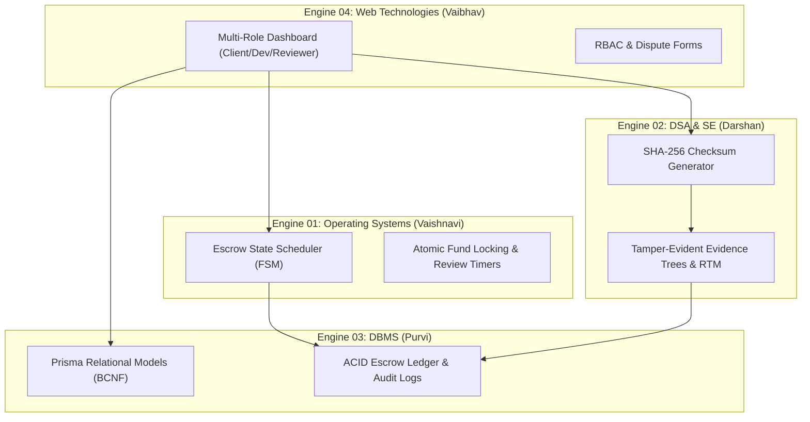

# Team 07 Project Overview & Engine Decomposition

> **Derived Documentation**
> **Source Documents**:
> - `docs/source-material/Team07_Escrow_Mini_Project_KLE_Theme.pptx`
> - `docs/source-material/Mini_Project_Gate_0_details_FILLED.docx`

---

## 1. Project Identity & Academic Context
- **Institution**: KLE Technological University's Dr. M. S. Sheshgiri College of Engineering and Technology, Belagavi
- **Department**: Department of Computer Science and Engineering
- **Curriculum Framework**: Engine-Based Mini-Project Framework with Hybrid SDLC
- **Team**: Team 07
- **Theme**: Theme 01
- **Project Title**: Milestone-Based Escrow & Evidence-Based Dispute Resolution Workflow

---

## 2. Team Members & Technical Responsibilities

| Student Name | Roll No | SRN | Owning Engine | Foundational Course Area |
| :--- | :--- | :--- | :--- | :--- |
| **Vaishnavi Modekar** | 21 | `02FE24BCS060` | **Engine 01 (OS Engine)** Escrow & State Scheduler | Operating Systems |
| **Darshan Kittur** | 18 | `02FE24BCS053` | **Engine 02 (DSA & SE Engine)** Evidence & Quality Assurance | Data Structures & Algorithms, Software Engineering |
| **Purvi Sammatshetti** | 11 | `02FE24BCS022` | **Engine 03 (DBMS Engine)** Transaction Ledger & Contracts | Database Management Systems |
| **Vaibhav Chavanpatil** | 4 | `02FE24BCS013` | **Engine 04 (Web Technologies Engine)** Role-Based Workflow Dashboard | Web Technologies, Computer Networks |

---

## 3. Four-Engine Architecture & Subject Mapping

### Engine 01 · Operating Systems Engine (Vaishnavi Modekar)
- **Role**: Escrow & State Scheduler
- **Key Responsibilities**:
  - Deterministic FSM state transitions: `AWAITING_DEPOSIT` → `FUNDED` → `IN_PROGRESS` → `UNDER_REVIEW` → `RELEASED`.
  - Atomic funds locking to prevent double-allocation or race conditions.
  - Timeout handling for unreviewed deliverables.
- **Academic Concepts**: Concurrency, mutexes, thread scheduling, deadlock prevention, circular queues.

### Engine 02 · DSA & Software Engineering Engine (Darshan Kittur)
- **Role**: Evidence & Quality Assurance Engine
- **Key Responsibilities**:
  - SHA-256 cryptographic deliverable checksum generation and verification.
  - Tamper-evident evidence tree data structures for dispute arbitration.
  - Verification & Validation (V&V) pipelines and Requirements Traceability Matrix (RTM).
- **Academic Concepts**: Hash maps, tree traversal optimization, algorithm complexity, software verification.

### Engine 03 · DBMS Engine (Purvi Sammatshetti)
- **Role**: Transaction Ledger & Contract Manager
- **Key Responsibilities**:
  - Relational schema normalization (BCNF) for Users, Projects, Gigs, Contracts, Milestones, and Payments.
  - ACID transactional integrity across escrow transfers.
  - Append-only tamper-resistant audit logs.
- **Academic Concepts**: BCNF normalization, ACID transactions, B-Tree indexes, trigger-based audit logging.

### Engine 04 · Web Technologies Engine (Vaibhav Chavanpatil)
- **Role**: Role-Based Workflow Dashboard
- **Key Responsibilities**:
  - Multi-role responsive dashboard for Clients, Freelancers, Dispute Reviewers, and Admins.
  - Role-Based Access Control (RBAC) middleware and secure session management.
  - Dispute filing forms and real-time milestone visual trackers.
- **Academic Concepts**: Next.js App Router, React 19 component composition, RESTful API consumption, Tailwind CSS.

---

## 4. Evaluation & Academic Gate Progression
- **Gate 0 (S0 — Problem Definition & Need Identification)**: Approved. Established stakeholder needs, AS-IS process analysis, and feasibility.
- **Gate 1 (S1 — Requirements Engineering)**: Week 4/5 deliverable focusing purely on SRS (FR/NFR), Use Cases, Acceptance Criteria, RTM, and Engine Decomposition. *Gate 1 forbids code or UI demonstrations as evidence; it reviews the requirements baseline.*
- **Gate 2 (S2 — Shared Architecture)**: System structure, engine boundaries, interface contracts, and design rationale.
- **Gate 3 (S3 — Implementation & Testing)**: TDD implementation, engine integration, unit/integration test coverage.
- **Gate 4 (S4 — Verification & Final Defense)**: End-to-end evidence demonstration, audit log inspection, and project presentation.
