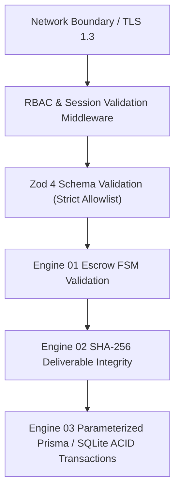

# Security Model & Baseline

> **Classification**: Security Specification & Defensive Baseline
> **Source Documents**:
> - `docs/source-material/Team07_Escrow_Mini_Project_KLE_Theme.pptx` (Slide 5, 16, 18, 19)
> - `docs/source-material/Mini_Project_Gate_0_details_FILLED.docx` (Step 7 R4)

---

## 1. Core Threat Model & Defense-in-Depth

The security posture assumes an untrusted operating environment where all inputs, network endpoints, and dependencies are potential attack vectors.

---

## 2. Confirmed Security Baseline Requirements

| Domain | Policy Requirement | Implementation Specification | Authority |
| :--- | :--- | :--- | :--- |
| **Secrets Management** | Zero secrets in Git; load from environment | Enforced via `.gitignore` and `scripts/security-check` | Project Standard |
| **Authentication** | Secure session tokens with bcrypt password hashing | Next.js HTTP-only session cookies / token verification | Slide 16, FR-08 |
| **Authorization** | Role-Based Access Control (RBAC) on all protected routes | Middleware validating `CLIENT`, `FREELANCER`, `REVIEWER`, `ADMIN` | Slide 16, FR-08, NFR-02 |
| **Data Integrity** | Cryptographic SHA-256 checksums on all deliverables | Node.js `crypto.createHash('sha256')` generated at upload | Slide 16 & 18, FR-03, NFR-03 |
| **Input Validation** | Strict boundary validation preventing SQLi and XSS | 100% of request payloads validated via Zod 4 schemas | Slide 16 & 19, NFR-04 |
| **Persistence Security** | Parameterized database queries; atomic ACID transactions | Prisma 5.22 ORM parameterized queries; atomic rollback | Slide 14 & 16, FR-05, NFR-08 |
| **Audit Immutability** | Append-only audit records with state transitions | SQLite `AUDIT_LOG` with actor, action, and hash | Slide 14 & 18, FR-06, NFR-09 |
| **Review Timers** | Prevent indefinite milestone lockup | Automated timeout mechanisms with reviewer override | Slide 12, R2 |

---

## 3. Incident & Vulnerability Protocol
1. Report security vulnerabilities directly following instructions in `SECURITY.md`.
2. Do not open public issues for unpatched vulnerabilities.
3. Automated security scans run via `./scripts/security-check` and GitHub Actions.
