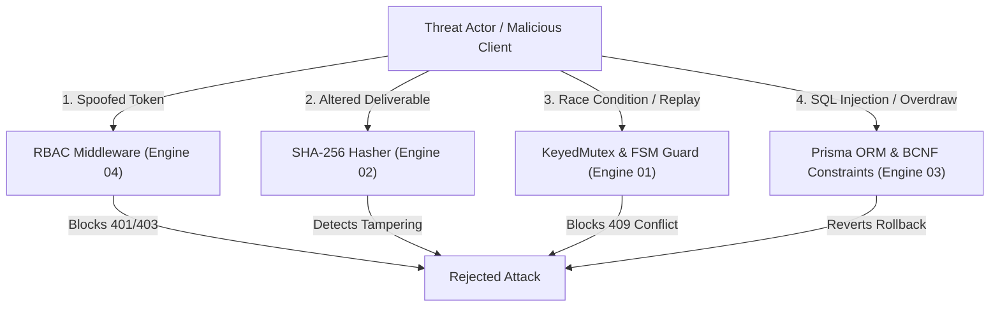

# Security Threat Model & RBAC Matrix Specification

> **Classification**: Authoritative Security Architecture Specification (Stage S2 — Shared Architecture)
> **Engine Ownership**: Engine 04 (Web / RBAC) & Engine 02 (DSA / Cryptography)
> **Methodology**: STRIDE (Spoofing, Tampering, Repudiation, Information Disclosure, Denial of Service, Elevation of Privilege)
> **Source Documents**:
> - `docs/source-material/Team07_Escrow_Mini_Project_KLE_Theme.pptx` (Slide 16, 18, 19)
> - `docs/source-material/Mini_Project_Gate_0_details_FILLED.docx` (Step 7 R4)
> - `docs/security/security-model.md`
> - `docs/decisions/ADR-008-rbac-security.md`

---

## 1. System Threat Landscape & STRIDE Taxonomy

The platform models an untrusted operating environment where network boundaries, client inputs, and session tokens are subject to adversarial pressure.



---

## 2. Threat Analysis & Defensive Control Matrix

| ID | STRIDE Class | Protected Asset | Threat Scenario | Attack Surface | Mitigation Strategy | Detection & Telemetry | Verification Test Case |
| :--- | :--- | :--- | :--- | :--- | :--- | :--- | :--- |
| **TH-01** | **Spoofing** | User Identity & Wallet Balance | Attacker forges session cookie to impersonate a Client or Reviewer. | HTTP Cookie / `session_token` | Signed JWT session token with HMAC-SHA256, HTTP-only, `SameSite=Strict`, `Secure` flags. | Warning log on invalid signature. | `test_rejects_forged_session_token()` |
| **TH-02** | **Tampering** | Deliverable Artifacts | Freelancer alters ZIP deliverable bytes post-submission to plant backdoors or claim unverified work. | Storage URI & Download Path | Node.js `crypto.createHash('sha256')` computed at upload and saved as immutable leaf in `EvidenceTree`. | Checksum mismatch triggers `EVIDENCE_TAMPERING_DETECTED` audit row. | `test_detects_modified_deliverable_bytes()` |
| **TH-03** | **Repudiation** | Escrow Release & Funding | Client disputes having released funds, claiming system error. | `POST /api/contracts` | Append-only `audit_logs` storing chained SHA-256 verification hash with actor ID and timestamp. | Institutional auditor verification of Merkle hash chain. | `test_audit_chain_proves_actor_action()` |
| **TH-04** | **Info Disclosure** | Passwords & Client Budgets | Attacker extracts hashes or other clients' unaccepted bids via API leakage. | REST API JSON Responses | Explicit DTO projection omitting `password_hash`; proposal bids hidden from competitors until project closes. | Zod response schema stripping unknown properties. | `test_api_scrubs_password_hashes()` |
| **TH-05** | **Denial of Service** | Escrow State Scheduler | Attacker floods concurrent release requests to cause lock contention or race conditions. | `/api/contracts` action endpoint | In-memory `KeyedMutex` serializes requests per `milestoneId` with 5000ms TTL. Rate limiting on IP. | High lock queue warnings logged. | `test_concurrent_actions_serialized_cleanly()` |
| **TH-06** | **Elevation of Priv** | Arbitration Rulings | Freelancer or Client executes reviewer ruling action to release funds to self. | `POST /api/disputes/{id}/ruling` | Server-side RBAC middleware validates `session.role === 'REVIEWER'` and verifies assignment. | 403 Forbidden logged with caller ID. | `test_non_reviewer_cannot_submit_ruling()` |
| **TH-07** | **Tampering** | Financial Balance | Attacker bids negative amounts or executes partial balance releases. | `POST /api/proposals`, `/api/contracts` | Zod schema constraints (`minimum(0.01)`) and SQLite `CHECK (balance >= 0.00)`. | Transaction failure logged. | `test_rejects_negative_currency_amounts()` |

---

## 3. Server-Side Role-Based Access Control (RBAC) Matrix

Authorization is strictly enforced server-side within Next.js Route Handlers. Presentation-layer component hiding is strictly UX ergonomics and is never relied upon for security.

$$\text{Decision} = \text{Authorized}(\text{UserRole}, \text{Resource}, \text{Action})$$

| Resource | Action | Public | `CLIENT` | `FREELANCER` | `REVIEWER` | `ADMIN` |
| :--- | :--- | :---: | :---: | :---: | :---: | :---: |
| **User Session** | Login / Register | **ALLOW** | **ALLOW** | **ALLOW** | **ALLOW** | **ALLOW** |
| **Projects** | Browse / Read Open | **ALLOW** | **ALLOW** | **ALLOW** | **ALLOW** | **ALLOW** |
| **Projects** | Create Project | DENY | **ALLOW** | DENY | DENY | DENY |
| **Projects** | Modify / Cancel Own | DENY | **ALLOW (Owner)** | DENY | DENY | **ALLOW** |
| **Proposals** | Submit Proposal Bid | DENY | DENY | **ALLOW** | DENY | DENY |
| **Proposals** | View Proposals on Project | DENY | **ALLOW (Owner)** | **ALLOW (Self)** | DENY | **ALLOW** |
| **Contracts** | Fund Escrow (`DEPOSIT`) | DENY | **ALLOW (Party)** | DENY | DENY | DENY |
| **Milestones** | Submit Deliverable | DENY | DENY | **ALLOW (Party)** | DENY | DENY |
| **Milestones** | Approve Deliverable | DENY | **ALLOW (Party)** | DENY | DENY | DENY |
| **Milestones** | Release Escrow | DENY | **ALLOW (Party)** | DENY | DENY | DENY |
| **Disputes** | Raise Dispute | DENY | **ALLOW (Party)** | **ALLOW (Party)** | DENY | DENY |
| **Disputes** | Inspect EvidenceTree | DENY | **ALLOW (Party)** | **ALLOW (Party)** | **ALLOW (Assigned)** | **ALLOW** |
| **Disputes** | Submit Binding Ruling | DENY | DENY | DENY | **ALLOW (Assigned)** | DENY |
| **Audit Logs** | Inspect System Audit Trail | DENY | DENY | DENY | DENY | **ALLOW** |

---

## 4. Authentication Architecture & Session Lifecycle

1. **Credential Storage**: Passwords hashed using Bcrypt with 10 salt rounds ($2^{10}$ key-stretching iterations). Plaintext passwords never stored in memory beyond initial verification.
2. **Session Generation**: Upon successful authentication, a cryptographically random session token (or signed JWT) is generated:
   - Stored in an HTTP-only, `SameSite=Strict`, `Path=/`, `Max-Age=86400` cookie.
   - Prevents Cross-Site Scripting (XSS) token theft and Cross-Site Request Forgery (CSRF).
3. **Session Validation Flow**:
   ```mermaid
   flowchart TD
       Req["Incoming HTTP Request"] --> CookieCheck{"session_token cookie present?"}
       CookieCheck -- No --> Reject401["HTTP 401 Unauthorized"]
       CookieCheck -- Yes --> Decrypt{"Valid signature & not expired?"}
       Decrypt -- No --> Reject401
       Decrypt -- Yes --> LoadUser["Load User from Database (id, role, status)"]
       LoadUser --> UserActive{"User account active?"}
       UserActive -- No --> Reject403["HTTP 403 Forbidden"]
       UserActive -- Yes --> InjectContext["Inject SessionContext into Request & Continue"]
   ```
4. **Session Termination (Logout)**: Overwrites the session cookie with empty value and `Max-Age=0`, invalidating the client token immediately.
